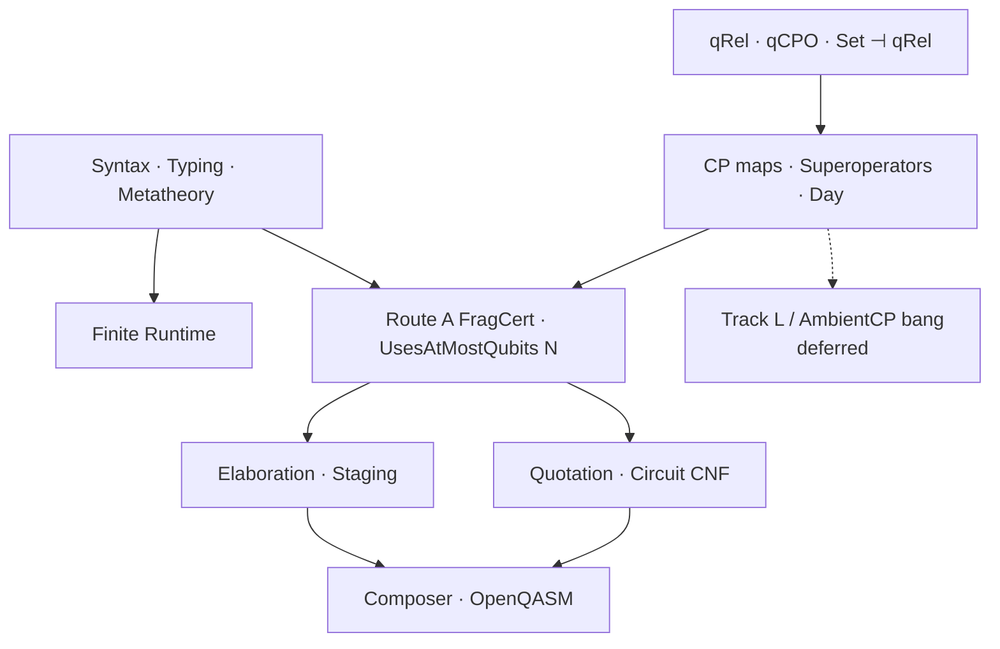
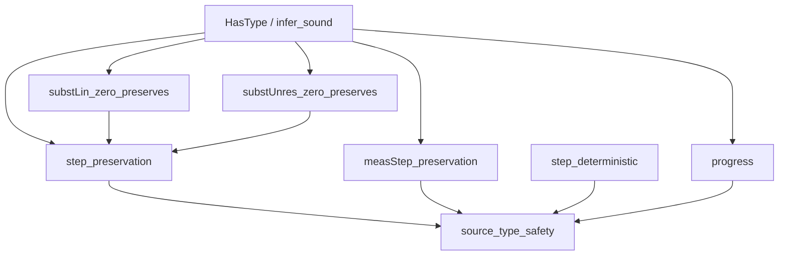
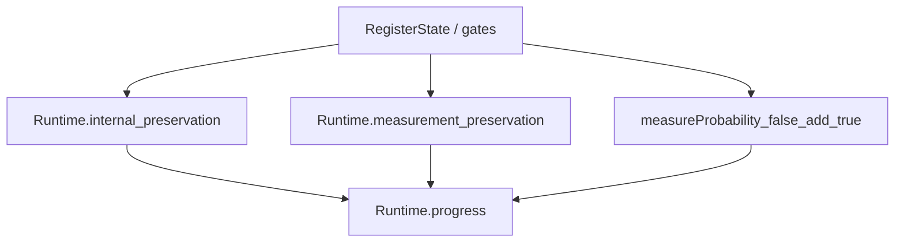
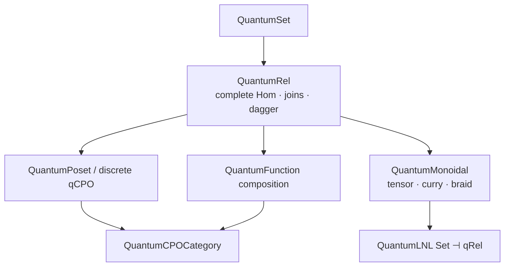
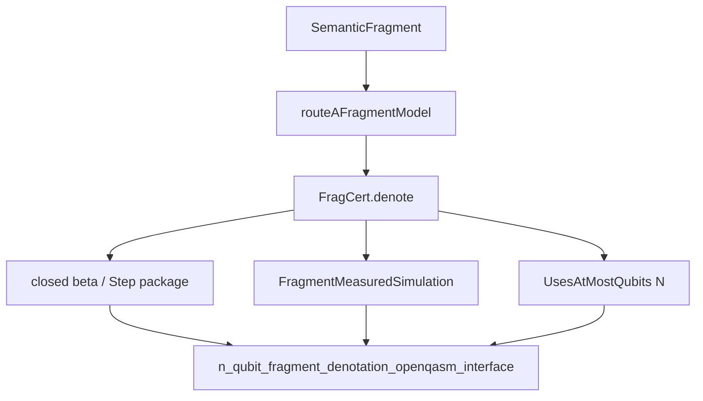
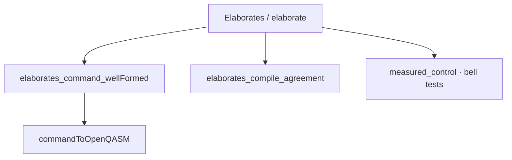
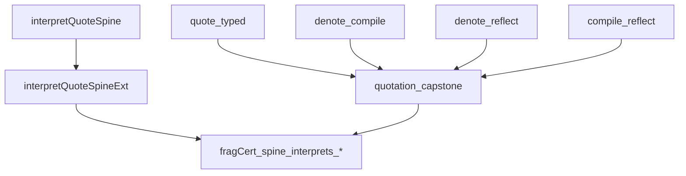
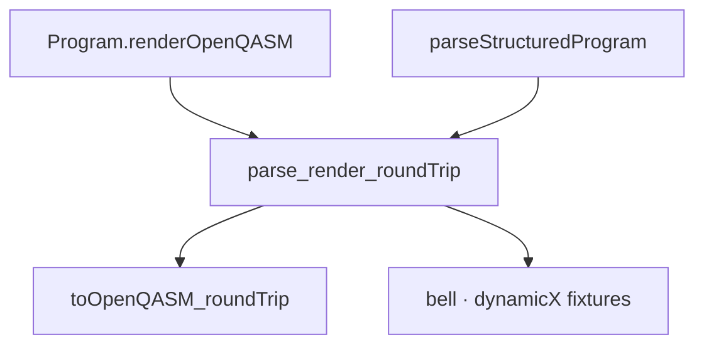
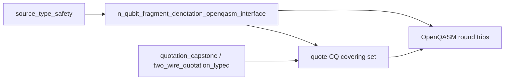

# Mechanized Denotation and Circuit Staging for an $N$-Bounded Linear Quantum $\lambda$-Fragment in Lean 4

**Author.** Lars Warren Ericson (independent researcher, d/b/a Catskills
Research Company; lars.ericson@catskillsresearch.com; ORCID
0000-0001-8299-9361).
**Technical report.** CMU-CS-26-XXX, School of Computer Science, Carnegie
Mellon University, Pittsburgh, PA 15213.
**Repository.** https://github.com/catskillsresearch/qlambda
**Cross-archive.** This report will also be deposited on arXiv in cs.LO,
math.LO, and quant-ph.

---

## Abstract

We present a Lean 4 formalization of a typed linear/nonlinear quantum
$\lambda$-calculus and a completed denotational and staging package for a
first-order fragment of programs that use at most $N$ live qubits.  Separate
unrestricted and linear contexts prevent implicit copy or discard of quantum
data.  The full language includes recursive types and $\mathsf{fix}$; the
fragment treated denotationally excludes them.  Probability arises only from
measurement.

Kernel-checked foundations include quantum relations, a compact-closed
$\mathsf{Set}\dashv\mathsf{qRel}$ model, quantum CPOs, and finite completely
positive maps; these do not yet form one model of the full language.  For the
fragment we check a Route~A CP-presheaf denotation (`FragCert.denote`),
`UsesAtMostQubits\,N`, measured $\mathsf{new0}$ Born adequacy, staging of
successfully elaborated closed terms to IBM Composer/OpenQASM, and
Hom-to-ideal-CQ agreement on a declared quotation covering set, including
two-wire circuit completeness.  Full-language bang/LNL, recursive-type
denotation, higher-order adequacy, and full abstraction remain objectives
behind AmbientCP Day-bang glue.

The mechanization gives new Lean proofs of quantum-relation complete-hom
lattices, bilateral join-continuity of composition, dagger reversal, quantum
function composition, and discrete qCPO completeness.  To our knowledge this
is the first machine-checked compact-closed $\mathsf{Set}\leftrightarrows
\mathsf{qRel}$ adjunction in this representation, and the first certified
typed lambda quotation theorem for the declared two-wire Composer fragment;
priority wording is limited by the literature audit below.  Sources:
https://github.com/catskillsresearch/qlambda.

---

## 1. Introduction

Quantum programming combines two incompatible structural regimes.  Classical
data may be weakened and contracted; unknown quantum data may not be copied,
and its disposal must be represented by a physical operation.  A semantics
that puts both kinds of values in an ordinary Cartesian context obscures this
distinction.  We instead use a linear/nonlinear judgment

$$
\Gamma;\Delta\vdash M:A,
$$

where $\Gamma$ contains unrestricted assumptions and $\Delta$ contains
exactly-once assumptions.  The semantic objective assigns a derivation a
morphism

$$
F\llbracket\Gamma\rrbracket\otimes\llbracket\Delta\rrbracket
\longrightarrow \llbracket A\rrbracket
$$

in a CP-enriched, $\omega$CPO-enriched LNL model.  That full model remains the
long-term target; the kernel-checked deliverable of this paper is the
$N$-bounded first-order fragment package summarized above.

This is a typed, type-indexed account.  It does not use a universal untyped
reflexive object.  In the intended model, each admissible recursive type has
its own approximation chain, quantum evolution is represented by linear
morphisms, and measurement is the source of probabilistic branching.  The
present Lean development establishes the source metatheory and supporting
categorical components but does not yet assemble that intended model.

### Contributions

The development has five connected parts.

1. It gives a Church-style linear/nonlinear quantum $\lambda$-calculus with
   de Bruijn syntax, verified formation predicates for recursive types,
   substitution, preservation, and a finite-register operational semantics.
2. It formalizes quantum-set and quantum-relation algebra, including complete
   hom orders, $\omega$-continuous composition, compact closure, the concrete
   $\mathsf{Set}\dashv\mathsf{qRel}$ LNL model, and a separate category of
   quantum CPOs and Scott-continuous quantum functions.
3. It gives a Route~A CP-presheaf denotation for a first-order fragment
   (no $\mu$/$\mathsf{fix}$), including classical-bit Day comonoid contexts,
   closed $\beta$/Step packaging, measured $\mathsf{new0}$ Born adequacy, and
   an $N$-qubit staging interface
   (`n_qubit_fragment_denotation_openqasm_interface`).
4. It constructs a deterministic, resource-certified staging procedure from
   closed elaborable fragment terms to circuit normal form and OpenQASM, with
   Hom$\Rightarrow$CQ agreement on a declared quotation covering set.
5. It gives canonical typed lambda quotation for a two-wire circuit fragment
   and a structured Composer/OpenQASM interchange with ideal
   classical--quantum denotation and canonical parse/render theorems.

The first substantial formalization obligation not available as an
off-the-shelf machine-checked library was the enriched algebra of quantum
relations. Weaver, Kornell, Jenča--Lindenhovius, and
Kornell--Lindenhovius--Mislove prove stronger paper-level categorical
results, but provide no Lean implementation of the chosen matrix/subspace
representation. We prove
the complete hom lattice, bilateral join-continuity of composition, closure
of functions under composition, and the discrete-qCPO instance directly.
The higher-order development further proves explicit tensor,
evaluation/currying, unitors, associator, braiding, and the ordinary strong
monoidal adjunction.  In particular it does not use the false route from
pointwise-ordered continuous maps to graph relations: graph is used from a
discretely ordered ordinary set category.

### Scope

The headline claim is the $N$-bounded fragment package above, not a finished
domain semantics of the full language.  “Circuit completeness” means that
every circuit in the declared finite target fragment (presently the supported
two-wire Composer quotation surface) has a canonical well-typed lambda
representative.  It does not mean that every unitary has an exact finite
decomposition, nor that every fragment term elaborates.  OpenQASM is an
interchange format here, not the denotational semantics, and no result concerns
calibration, noise, transpiler heuristics, or arbitrary Python/Qiskit programs.
The AmbientCP / Track~L path is the intended extension to bang, recursive
types, and full-language adequacy; it is open, not abandoned.

### Lean development structure

The mechanization is layered.  Source metatheory and the finite runtime sit
above a quantum-relation / qCPO substrate and a CP-presheaf fragment model;
staging and quotation connect the fragment to Composer/OpenQASM.  Track~L
bang glue is deferred and does not block the $N$-bounded package.

**Figure.** Layered Lean development: checked $N$-bounded fragment path (solid)
versus deferred Track~L bang glue (dashed).

---

## 2. The Typed Linear Language

The binder mode, types, physical constants, terms, and values are:

$$
\kappa ::= \mathsf{lin}\mid\mathsf{unres},
$$

$$
A,B ::= \alpha \mid 1 \mid \mathsf{Bit}\mid\mathsf{Qubit}
       \mid A\otimes B
       \mid A\multimap B
       \mid A\to B
       \mid \mu\alpha.A.
$$

Here $A\multimap B$ abbreviates
$\mathsf{arrow}(\mathsf{lin},A,B)$ and $A\to B$ abbreviates
$\mathsf{arrow}(\mathsf{unres},A,B)$.  Recursive type variables use de Bruijn
indices; $\mu A$ binds type index zero in $A$.

$$
\begin{aligned}
p ::= {}&
  \mathsf{new0}\mid \mathsf X\mid \mathsf H\mid \mathsf T
  \mid \mathsf{RY}(r)\mid \mathsf{CX}\mid \mathsf{reset},
  \qquad r\in\mathbb Q,\\[2mm]
M,N,K ::= {}&
  x^{\kappa}_{n}
  \mid \lambda^{\kappa}(A).M
  \mid M\,N
  \mid \langle\rangle
  \mid \mathsf{bit}(b)\\
 &\mid \langle M,N\rangle
  \mid \mathsf{unpair}\;M\;K
  \mid \mathsf{if}\;M\;\mathsf{then}\;N\;\mathsf{else}\;K\\
 &\mid p
  \mid \mathsf{measure}\;M\;K
  \mid \mathsf{fix}_{A}\;M
  \mid \mathsf{fold}_{A}\;M
  \mid \mathsf{unfold}\;M ,
  \qquad b\in\{\mathsf{false},\mathsf{true}\}.
\end{aligned}
$$

Term variables use separate de Bruijn indices in the unrestricted and linear
contexts, selected by $\kappa$.  Lambda is the only term binder.  The
eliminator $\mathsf{unpair}\;M\;K$ applies the curried linear continuation
$K:A\multimap B\multimap C$ to the two components of
$M:A\otimes B$.  Similarly, $\mathsf{measure}\;M\;K$ consumes
$M:\mathsf{Qubit}$ and invokes
$K:\mathsf{Bit}\to\mathsf{Qubit}\multimap A$: the measured bit is
unrestricted, while the post-measurement qubit remains linear.

The constants have the following complete source types:

$$
\begin{array}{rcl@{\qquad}rcl}
\mathsf{new0} &:& 1\multimap\mathsf{Qubit}
&
\mathsf X,\mathsf H,\mathsf T,\mathsf{RY}(r)
&:& \mathsf{Qubit}\multimap\mathsf{Qubit}
\\
\mathsf{CX} &:&
  \mathsf{Qubit}\multimap\mathsf{Qubit}\multimap
  (\mathsf{Qubit}\otimes\mathsf{Qubit})
&
\mathsf{reset} &:&
  \mathsf{Qubit}\multimap\mathsf{Qubit}.
\end{array}
$$

The call-by-value values are

$$
V,W ::= \langle\rangle\mid\mathsf{bit}(b)
       \mid\lambda^\kappa(A).M
       \mid\langle V,W\rangle
       \mid p
       \mid\mathsf{fold}_{A}\;V.
$$

Qubits are not closed source values; runtime wire handles inhabit the machine
boundary.  Probability is likewise absent from the term grammar and appears
only on measurement transitions.  There is no `emit`, source sequencing
primitive, probabilistic choice, internal choice, or external choice.

### 2.1 Contexts and typing

Typing judgments have the form

$$
\Gamma;\Delta\vdash M:A,
\qquad
\Gamma ::= \cdot\mid\Gamma,A,
\qquad
\Delta ::= \cdot\mid\Delta,\_ \mid\Delta,A.
$$

The unrestricted context $\Gamma$ is a list of types.  The linear context
$\Delta$ is a position-preserving list of optional types: an empty cell
$\_$ records a consumed or absent de Bruijn position.

Unrestricted variables may be weakened and contracted.  A linear context is a
list of optional type cells; context splitting partitions occupied cells while
preserving de Bruijn positions.  Linear application and tensor introduction
split the linear context.  An unrestricted closure may not capture live linear
resources.

Lean declarations are concentrated in:

- `QLambda/Linear/Syntax.lean`;
- `QLambda/Linear/Context.lean`;
- `QLambda/Linear/Typing.lean`;
- `QLambda/Linear/TypeFormation.lean`.

The executable type checker is connected to the proof-level typing relation.
Negative examples include cloning a qubit and capturing a live qubit in an
unrestricted function.

### 2.2 Substitution and source safety

The formal substitution proof distinguishes used and unused linear variables.
It includes split rotation, all-`none` transport, linear substitution, and
unrestricted substitution with empty linear support.  These results imply
preservation for deterministic source reduction and for measurement-labelled
transitions.

For closed nonrecursive terms, progress yields either a value, a classical
step, or a genuine quantum blocking point.  It is not the vacuous statement
that a primitive is “stuck.”

### 2.3 Theorem dependence

The Palomar-facing type-safety package sits on preservation, progress, and
determinism; those in turn rest on substitution and the typing judgment.

**Figure.** Section~2 theorem dependence: typing and substitution support
preservation/progress; `source_type_safety` packages the closed-program
capstone.

---

## 3. Finite Quantum Runtime

A runtime configuration contains a finite register state, allocated-wire
information, an environment, and a typed control stack.  Gates act by their
canonical matrices.  Reset discards and reinitializes one wire.  Measurement
has two labelled branches whose weights are obtained from the Born rule.

The runtime proves:

- internal-transition preservation;
- measurement-transition preservation;
- nonnegativity and upper bounds of branch probabilities;
- normalization of the two measurement outcomes;
- progress modulo finite-wire exhaustion.

The runtime does not add source-level probability.  Probabilities label
physical measurement transitions only.

### 3.1 Theorem dependence

**Figure.** Section~3 theorem dependence: register dynamics support internal
and measurement preservation, Born normalization, and runtime progress.

---

## 4. Quantum Sets, Relations, and qCPOs

A quantum set $X$ is a family of finite-dimensional Hilbert spaces
$(X_x)_{x\in\operatorname{At}(X)}$.  A quantum relation $R:X\to Y$ assigns to
each pair $(x,y)$ a complex linear subspace

$$
R(x,y)\subseteq \mathcal L(X_x,Y_y).
$$

Relations are ordered pointwise by inclusion.  Composition takes the span of
operator products over intermediate atoms, and dagger takes adjoints while
reversing atom pairs.

### 4.1 Formalized relation algebra

`QLambda/Domain/QuantumRel.lean` proves:

$$
(T\circ S)\circ R=T\circ(S\circ R),\qquad
R\circ 1=R=1\circ R,
$$

$$
(S\circ R)^\dagger=R^\dagger\circ S^\dagger,
$$

and

$$
\left(\bigvee_n S_n\right)\circ R
 =\bigvee_n(S_n\circ R),\qquad
S\circ\left(\bigvee_n R_n\right)
 =\bigvee_n(S\circ R_n).
$$

Each hom is a complete lattice.  Consequently quantum sets and quantum
relations form an $\omega$CPO-enriched category `qRelCategory`.

A relation is a quantum function when it satisfies the usual dagger
inequalities.  Comparable quantum functions are equal, and quantum functions
are closed under composition.  Unitary matrices yield quantum functions, and
the formalized $H$, $X$, $T$, $RY$, and $CX$ matrices agree with their
completed-CP presentations.

### 4.2 Quantum posets and completeness

A quantum poset is a quantum set with a reflexive, transitive, antisymmetric
quantum relation.  The qCPO condition is stated using increasing sequences of
functions from atomic probes.  Discrete quantum posets are qCPOs because
comparability forces equality, so every such chain is constant.  This gives
the qubit, classical bit, and tensor-unit objects used by the finite fragment.

`QuantumMonoidal.lean` supplies tensor on homs, internal hom, evaluation,
currying, unitors, associator, and braiding, and proves the required
$\omega$-supremum laws.  `QuantumLNL.lean` packages the resulting concrete
model.  Its nonlinear category consists of sets and functions with discrete
hom orders; classical inclusion is the graph functor and its right adjoint is
the set of relations from the tensor unit.  This deliberately avoids the
non-monotone graph map from pointwise-ordered continuous-function homs.

Separately, `QuantumCPOCategory.lean` packages quantum CPOs and
Scott-continuous quantum functions as an $\omega$CPO-enriched category.  The
formalization does not identify that category with the linear category of the
concrete `Set`--`qRel` adjunction. The published recursive LNL route instead
uses the quantum lift monad and its Kleisli category; that construction is not
yet present here.

### 4.3 Theorem dependence

**Figure.** Section~4 theorem dependence: quantum-relation algebra supports the
concrete LNL packaging and the separate Scott-function qCPO category.

---

## 5. Type-Indexed Denotation and Recursive Types

This section separates the kernel-checked Route~A fragment denotation from the
intended full-language model.  The fragment package (first-order data, linear
FO-domain arrows, unrestricted bit binders, primitives, measurement; no
$\mu$/$\mathsf{fix}$) supplies compositional `FragCert.denote`, classical-bit
Day contexts, closed $\beta$/Step laws, measured $\mathsf{new0}$ Born
adequacy, and the $N$-qubit OpenQASM staging interface; see §9.  The intended
full-language interpretation still assigns

$$
\llbracket\Gamma;\Delta\rrbracket
 =F\llbracket\Gamma\rrbracket\otimes\llbracket\Delta\rrbracket.
$$

Tensor and arrows are to be interpreted by the monoidal and closed structure.
Primitives are to embed the checked presentation-independent finite CP
classes, and measurement is to be interpreted as a finite instrument into a
classical sum while retaining the post-measurement qubit.

For a strictly positive recursive body $A(\alpha)$, the intended object
$\llbracket\mu\alpha.A\rrbracket$ is the bilimit of its finite unfolding
chain.  `QLambda/Domain/RecursiveTypes.lean` constructs the carrier of
compatible approximants and its complete-lattice structure.  Dropping and
restoring the zeroth approximation define inverse $\omega$-continuous maps,
packaged as `ProjectionChain.shiftIso`.  It does not yet construct the
source-type functor or connect strict positivity to a concrete unfolding
chain.

`QLambda/Linear/Denotation.lean` records the operations needed by every typing
rule, its desired constructor equations, and presentation-independent finite
CP meanings for physical primitives.  No concrete full-language
`DenotationModel` instance exists.  Classical beta, fix unfolding, and
fold/unfold are exact only in the operational quotient generated by source
reduction; these are not yet full-language denotational soundness or adequacy
theorems.

The finite CP substrate for that target is now checked: intrinsic Choi maps
are equivalent to the existing completed Kraus classes, TNI superoperators
contain allocation, reset, gates, and measurement branches, and specialized
modules have Yoneda, representable Day tensor, representable internal hom,
and finite symmetric powers.  First-order source types (unit, bits, qubits,
and their tensors) have representable objects, and every source primitive
agrees with its intrinsic superoperator.  The symmetric series has weakening,
dereliction, contraction, and promotion along finite basis equivalences.

A stronger fragment is now kernel checked for low dimensions.  For every
system of dimension $A\le 1$, the formal series exponential carries a genuine
Day comonoid structure and satisfies the cofree universal property
$$
\operatorname{ComonoidHom}(C,!A)
  \cong \operatorname{Hom}(C,y(A)),
$$
inducing co-Kleisli promotion $\operatorname{Hom}(!B,A)\to\operatorname{Hom}(!B,!A)$.
At the same time, two TNI obstructions are checked.  Complementary
computational-basis effects on a qubit sum to discard, but composition with
matching isometric preparations yields two copies of $\mathrm{id}_1$, which
admit no TNI Choi sum; hence generic joint precomposition at fiber dimension
$d\ge 2$ fails for representable modules.  Separately, every canonical
homogeneous bang split of total degree $k$ has the same effect as the unsplit
coefficient, so the joint effect is $(k+1)$ copies of that effect: the
proposed raw Route~A joint-effect bound already fails at $A=2$, degree $1$.
These refutations do not by themselves prove failure of every Day-bilinear
admissibility predicate: transferring the effect witness into
`BangComultComponentsAdmissible` requires an explicit bilinear that recovers
both ordered degree-one splits in one TNI fiber
(`BangComultDayTransferWitness`).  We prove that any such witness implies
$\neg\,\texttt{BangComultComponentsAdmissible}\ 2$ by extracting the selected
two-term row through flattening and reindexing, but no TNI/representable
construction of the witness is given (fixed projection pairs recover only one
ordering; product modules separate summands; unscaled addition of both
orderings leaves the TNI carrier).  Gate~L8 therefore publishes the named
replacement category `AmbientCPDayBangCategory` of unrestricted-CP fibers
(`cpmModule`), which restores binary fiber sums and joint action at every
dimension and cannot host the nonsummable Bool pair; the Gate~8 suite is
`ambientCP_gate8_testSuite`, with terminal theorem
`day_bang_l8_resolved_by_ambientCP_replacement`.
`BangSplitEffectAdmissible` is
the global universal Route~A bound, not a hereditary carrier-membership
predicate; it fails at $A=2$ by excluding the degree-one identity series.
Scaling by $\tfrac12$ repairs the $(A,k)=(2,1)$ joint-effect matrix bound to
$I$, but left/right counit force the $(0,1)$ and $(1,0)$ boundary weights to
remain $1$, so uniform half-scaling is not a counital repair.  The
coefficientwise tensor-square object is still not the genuine Day tensor of
two series modules.  General Day closure for based modules, an
all-dimensional TNI cofree exponential, a bang rebuilt in the ambient-CP
replacement, the based double-dual classical subcategory, and the LNL package
remain objectives.  Consequently unrestricted
arrows are not yet interpreted for $A\ge 2$.  The intended adequacy boundary
is closed terms with first-order observable result: denotation should equal
the supremum of finite-step subnormalized operational instruments.  Adequacy
at arbitrary higher-order result types and full abstraction are not claimed.

### 5.1 Target compositional semantics

For clarity, we state the complete Scott--Strachey-style definition that the
remaining formalization must realize.  This subsection is a specification,
not a list of completed theorems.  In the intended linear category
$\mathcal L$, with tensor unit $I$, additives, internal hom
$\multimap$, and exponential $!$, type objects are

$$
\begin{aligned}
\llbracket 1\rrbracket &= I,&
\llbracket\mathsf{Bit}\rrbracket &= I\oplus I,&
\llbracket\mathsf{Qubit}\rrbracket &= y(2),\\
\llbracket A\otimes B\rrbracket
  &=\llbracket A\rrbracket\otimes\llbracket B\rrbracket,&
\llbracket A\multimap B\rrbracket
  &=\llbracket A\rrbracket\multimap\llbracket B\rrbracket,&
\llbracket A\to B\rrbracket
  &=!\llbracket A\rrbracket\multimap\llbracket B\rrbracket .
\end{aligned}
$$

For a strictly positive body $A(\alpha)$,
$\llbracket\mu\alpha.A\rrbracket$ is the embedding--projection colimit of

$$
0\longrightarrow \llbracket A\rrbracket(0)
 \longrightarrow \llbracket A\rrbracket^2(0)
 \longrightarrow\cdots ,
$$

with inverse continuous maps
$\mathsf{fold}_A:\llbracket A[\mu\alpha.A/\alpha]\rrbracket
\rightleftarrows\llbracket\mu\alpha.A\rrbracket:\mathsf{unfold}_A$.
The context object is

$$
C_{\Gamma;\Delta}
 =F\!\left(\prod_{A\in\Gamma}G\llbracket A\rrbracket\right)
   \otimes\bigotimes_{A\in\Delta}\llbracket A\rrbracket ,
$$

where an empty linear cell contributes $I$.  A typing derivation denotes
$\llbracket\Gamma;\Delta\vdash M:A\rrbracket:
C_{\Gamma;\Delta}\to\llbracket A\rrbracket$.

Let $\mathsf{split}_s$ be the structural map induced by a verified linear
context split $s$, let $\mathsf{lookup}^{\omega}$ and
$\mathsf{lookup}^{1}$ be unrestricted and linear projections, and let
$\mathsf{discard}$ be the structural map available exactly for an all-empty
linear context.  Writing $\mathsf{ev}_\kappa$, $\mathsf{curry}_\kappa$,
$\mathsf{tensorElim}$, and $\mathsf{bitElim}(f,g)$ for the corresponding
model-derived maps, the term clauses are required to be:

$$
\begin{aligned}
\llbracket x^\omega_n\rrbracket
  &=\mathsf{lookup}^{\omega}_n,\\
\llbracket x^1_n\rrbracket
  &=\mathsf{lookup}^{1}_n,\\
\llbracket\lambda^\kappa(A).M\rrbracket
  &=\mathsf{curry}_\kappa(\llbracket M\rrbracket),\\
\llbracket M\,N\rrbracket
  &=\mathsf{ev}_\kappa\circ
    (\llbracket M\rrbracket\otimes\llbracket N\rrbracket)
    \circ\mathsf{split}_s,\\
\llbracket\langle\rangle\rrbracket
  &=\mathsf{unit}\circ\mathsf{discard},\\
\llbracket\mathsf{bit}(b)\rrbracket
  &=\mathsf{bit}_b\circ\mathsf{discard},\\
\llbracket\langle M,N\rangle\rrbracket
  &=(\llbracket M\rrbracket\otimes\llbracket N\rrbracket)
    \circ\mathsf{split}_s,\\
\llbracket\mathsf{unpair}\;M\;K\rrbracket
  &=\mathsf{tensorElim}\circ
    (\llbracket M\rrbracket\otimes\llbracket K\rrbracket)
    \circ\mathsf{split}_s,\\
\llbracket\mathsf{if}\;B\;M\;N\rrbracket
  &=\mathsf{bitElim}(\llbracket M\rrbracket,\llbracket N\rrbracket)
    \circ(\llbracket B\rrbracket\otimes\mathsf{id})
    \circ\mathsf{split}_s,\\
\llbracket p\rrbracket
  &=\mathsf{prim}_p\circ\mathsf{discard},\\
\llbracket\mathsf{measure}\;M\;K\rrbracket
  &=\mathsf{handleMeasure}\circ
    (\llbracket M\rrbracket\otimes\llbracket K\rrbracket)
    \circ\mathsf{split}_s,\\
\llbracket\mathsf{fix}_A\;M\rrbracket
  &=\bigsqcup_{n<\omega}\Phi_{\llbracket M\rrbracket}^{\,n}(\bot),\\
\llbracket\mathsf{fold}_A\;M\rrbracket
  &=\mathsf{fold}_A\circ\llbracket M\rrbracket,\\
\llbracket\mathsf{unfold}\;M\rrbracket
  &=\mathsf{unfold}_A\circ\llbracket M\rrbracket .
\end{aligned}
$$

Here $\mathsf{prim}_p$ must be the checked CP map for the complete primitive
signature, and $\mathsf{handleMeasure}$ must use the two subnormalized maps
$\rho\mapsto P_b\rho P_b$ while promoting the known outcome bit and retaining
the measured qubit.  The implementation is complete only when these clauses
are derived from the concrete model, independent of typing derivations, and
validated by substitution, soundness, and adequacy.

### 5.2 Theorem dependence (Route A fragment)

**Figure.** Section~5 checked-fragment theorem dependence culminating in the
$N$-qubit staging interface package.

---

## 6. Deterministic Staging to Circuits

The circuit-normal fragment has statically bounded qubit and classical
registers.  A prefix allocator produces `Fin q` wire indices and proves
freshness, distinctness, and bounds.  Fresh-qubit allocation lowers to reset
on a fresh physical wire.

Staging is a fuelled call-by-value evaluator.  Lambdas, including
higher-order gate combinators, execute at staging time.  A successful result
contains first-order data only.  Recursive types and general recursion remain
in the language semantics but are excluded from this finite compilation
fragment.

Lean proves successful staging is deterministic and preserves source type,
resource typing, circuit well-formedness, and allocation bounds.  Regression
examples include Bell preparation, measurement-controlled gates, reset/reuse,
and higher-order gate composition.

### 6.1 Theorem dependence

**Figure.** Section~6 theorem dependence: successful elaboration yields
well-formed Composer commands, CQ compile agreement, and OpenQASM export.

---

## 7. Circuit Reflection and Completeness

`QLambda/Linear/Circuit.lean` translates between the circuit normal form and
the supported Composer block fragment.  Compilation preserves ideal CQ
denotation.  Reflection is total on a proof-carrying supported block, and
compilation after reflection returns the original block.

A canonical lambda quotation uses unrestricted binders for classical slots
and linear binders for wires.  `QuotationGeneral.lean` covers two qubits and
one classical bit, including distinct-wire $CX$, measurement,
reset/reuse, store, sequencing, and conditionals.  It excludes
the unsupported coin command by an explicit `Quotable` predicate.

The checked circuit-level declarations have the following meanings:

- `denote_compile`: the quotation meaning, defined from the represented
  command, equals that command's CQ denotation;
- `denote_reflect`: command reflection preserves the same inherited CQ
  denotation;
- `compile_reflect`: compiling a canonical representative returns the
  canonical circuit;
- `quotation_capstone`: every `Quotable` command has a well-typed canonical
  lambda representative whose compilation is the original command and whose
  inherited CQ denotation is equal to the circuit denotation.

These results give circuit-level completeness for the declared two-wire
Quotable surface.  At the fragment level, closed quotations in the covering
set identify `FragCert.denote` with ideal `CQ.Sem` via
`interpretQuoteSpine` / `interpretQuoteSpineExt`, and successful elaboration
reuses `elaborates_compile_agreement` together with quote-normal-form
transport.  A general extract of `CQ.Sem` from an arbitrary quotation Hom,
and dedicated spines for every remaining `Quotable` constructor, remain open;
so does a full-language source-level `denote_compile` theorem beyond the
fragment packaging.

### 7.1 Theorem dependence

**Figure.** Section~7 theorem dependence: two-wire quotation capstone and the
extended Hom$\Rightarrow$CQ covering-set spines.

---

## 8. Composer and OpenQASM Interchange

The target is a frozen, versioned AST with finite registers.  The supported
structured subset includes gates, measurement, reset, classical assignment,
conditionals, switches, bounded loops, boxes, and structured loop control
where the ideal semantics is defined.

Rendering produces canonical OpenQASM text.  Parsing accepts exactly the
declared canonical presentation and proves render/parse round trips under the
`ParserCanonical` boundary.  This is deliberately not a parser for arbitrary
OpenQASM 3 text.

Circuit denotation is an ideal classical--quantum instrument.  Sequencing is
instrument bind; measurement updates a classical slot; structured control is
interpreted compositionally.  Barriers and delays remain syntax but are
identities in the ideal semantics.

### 8.1 Theorem dependence

**Figure.** Section~8 theorem dependence: canonical OpenQASM render/parse
round trips on the declared structured subset.

---

## 9. Mechanized Claims and Release Boundary

The following components are kernel checked without semantic axioms:

- source scope, typing, substitution, preservation, and progress;
- finite-register gate/reset/measurement runtime and normalization;
- pointed $\omega$CPO maps, products, evaluation, currying, and least fixed
  points;
- complete quantum-relation hom lattices and enriched composition;
- tensor/internal-hom closure and the concrete `Set`--`qRel` LNL model;
- the category of qCPOs and Scott-continuous quantum functions;
- inverse continuous shift maps for projection-chain bilimits;
- discrete qCPO instances and finite CP/gate presentations;
- Route~A fragment denotation (`FragCert.denote`), classical-bit Day
  comonoid contexts, closed fragment $\beta$/Step packaging, and measured
  $\mathsf{new0}$ Born adequacy;
- $N$-qubit staging interface (`UsesAtMostQubits`, successful `Elaborates`
  $\Rightarrow$ well-formed Composer, `commandToOpenQASM`) and covering-set
  Hom$\Rightarrow$CQ quotation bridges;
- deterministic staging with resource certificates;
- circuit/Composer correspondence on the supported block fragment;
- typed lambda quotation and circuit completeness for the declared two-wire
  fragment;
- structured canonical OpenQASM round trips.

The theorem boundary does not include an equivalence between the checked LNL
and qCPO categories, a fully instantiated denotation of every admissible
recursive source type, full abstraction, or unrestricted adequacy.  It also
does not include noisy-device behavior or exact finite synthesis of every
unitary.  Missing semantic structure is not introduced as an axiom or hidden
as a theorem parameter.

### Semantic objectives

Checked progress now includes the Day bang comonoid and cofree universal
property for $A\le 1$, the fiber-$2$ TNI obstruction, the raw Route~A
split-family refutation, and the failure of the global raw split-effect
bound at $A=2$.  Half-scaling repairs the $(2,1)$ joint-effect matrix
bound but is not a counital repair (boundary weights remain $1$);
the implication from `BangComultDayTransferWitness` to failure of
dimension-two Day admissibility is checked; no TNI witness is constructed,
and L8 instead records `AmbientCPDayBangCategory` /
`day_bang_l8_resolved_by_ambientCP_replacement`.  The finite CP maps, TNI
superoperators, representable Yoneda/Day fragment, first-order type objects,
$A\le 1$ bang/cofreeness, Route~A/global-bound refutations, ambient-CP Gate~8
replacement, and primitive agreement are checked; they are not an
all-dimensional LNL instance or full-language denotation.  The minimum
fragment (first-order data, linear FO-domain arrows, unrestricted bit
binders, primitives, measurement) has a checked Route~A
`PresheafFragmentModel`, compositional `FragCert.denote` via controlled
`iteElim`, classical-bit Day comonoid contexts with Day/FO closed β/η,
closed FO `ite`, closed linear and unrestricted identity β, closed `unpair`
β, constant unrestricted subst β, Step congruence /
`fragment_step_denote_sound_complete`, measured `new0` Born adequacy
(`FragmentMeasuredSimulation`), and the N-qubit packaging theorem
`n_qubit_fragment_denotation_openqasm_interface` (`UsesAtMostQubits`,
successful `Elaborates` ⇒ well-formed Composer, `commandToOpenQASM`).
Hom-side quote spines and `interpretQuoteSpine` /
`interpretQuoteSpineExt` identify `FragCert.denote` with ideal `CQ.Sem` for
skip/x/h and a covering set of Quotable forms (t/reset/measure/seq-skip;
branch via `interpretQuoteHom` packaging).  Remaining Quotable constructors
without dedicated Hom spines and undecidable arbitrary Hom→CQ extract stay
open; Track~L / bang are independent.  The concrete physical-bit
copy/discard is not counital; `classicalBitModule` is the unrestricted
carrier with checked comonoid laws.  Track L packages are deferred on L9:
relative AmbientCP admissibility for $A\le 1$, a degree-row gate at 2, and
`AmbientCPComonoid` packaging for $A\le 1$ are checked; A=1-style glue is
blocked by `$\neg$ BangDegreeUnitRectangleHasSum 2`, so glued
`BangComultAmbientCPAdmissible 2` remains open (absolute A=2 not claimed).

### 9.1 Claim-surface dependence

**Figure.** Section~9 claim-surface dependence among the Palomar-facing and
$N$-bounded packaging theorems.

---

## 10. Related Work and Novelty Qualification

Weaver introduced quantum relations as operator subspaces.  Kornell,
Lindenhovius, and Mislove developed quantum posets and quantum CPOs and used
them for recursive quantum programming.  Selinger and Valiron established
linear/nonlinear semantic methods for higher-order quantum computation.
Pagani, Selinger, and Valiron gave quantitative semantics, and Tsukada and
Asada developed enriched presheaf models with strong recursion and
full-abstraction results.

Those works are the semantic foundation and prove stronger paper-level
results than claimed here: complete relation homs, arbitrary-join-preserving
composition, dagger compactness, quantum-function order, qCPO enrichment, and
the lifted recursive LNL model all have explicit literature support. Our
novelty claim is therefore limited to Lean formalization of the selected
representation and its integration with the typed source and finite circuit
pipeline. We list exact declarations. Absence of another proof-assistant
implementation from the sources checked is not itself a mathematical priority
proof.

---

## References

- A. Kornell, B. Lindenhovius, and M. Mislove, *Quantum CPOs*, 2021,
  arXiv:2109.02196.
- N. Weaver, *Quantum relations*, Memoirs of the American Mathematical
  Society 215(1010), 2012.
- A. Jenča and B. Lindenhovius, *Monoidal Quantaloids*, 2025.
- A. Kornell et al., *A Category of Quantum Posets*, 2023.
- A. Kornell et al., *Categories of Quantum CPOs*, arXiv:2406.01816.
- P. Selinger and B. Valiron, *A lambda calculus for quantum computation with
  classical control*, Mathematical Structures in Computer Science 16(3),
  2006.
- M. Pagani, P. Selinger, and B. Valiron, *Applying quantitative semantics to
  higher-order quantum computing*, POPL, 2014.
- T. Tsukada and K. Asada, *Enriched presheaf model of quantum FPC*, 2024.
- Committee on Publication Ethics (COPE). *Authorship and AI tools: COPE
  position statement*. 2024.
  <https://publicationethics.org/guidance/cope-position/authorship-and-ai-tools>
<!-- AI_MODEL_REFERENCES -->
- **[Cur26]** Anysphere, Inc. *Cursor: AI-native code editor and agent environment*. <https://cursor.com> (accessed 2026).
- **[Grk47]** xAI. *Grok 4.7*. Model documentation as integrated in Cursor, <https://cursor.com/docs/models> (accessed 2026).
- **[Cla55]** Anthropic. *Claude Opus 5.5*. Model documentation as integrated in Cursor, <https://cursor.com/docs/models> (accessed 2026).
- **[Gpt56]** OpenAI. *GPT 5.6*. Model documentation as integrated in Cursor, <https://cursor.com/docs/models> (accessed 2026).
- **[Cmp25]** Anysphere, Inc. *Composer 2.5*. Model documentation as integrated in Cursor, <https://cursor.com/docs/models> (accessed 2026).
<!-- /AI_MODEL_REFERENCES -->

---

## Acknowledgments

The human author retains sole responsibility for the mathematical content,
the choice of formalization route, and every formal claim in this work.
Following standard publisher practice (for example, COPE guidance on
authorship and AI tools), no large language model is listed as a co-author.

Lean and this narrative were produced with AI-agent assistance under the
author's direction and review.  The trusted proof object is the Lean kernel
output, not generated prose or tests.  Assistance from the following tools
is recorded in `scripts/ai_model_cards.py` and expanded when building
`arxiv.tex`:

<!-- AI_MODEL_TOOL_BULLETS -->
- **Cursor** **[Cur26]** — agent-assisted editing in the Cursor IDE for the typed linear calculus, quantum-relation and qCPO developments, the CP-presheaf substrate, circuit quotation, and drafting this narrative. Generated Lean was provisional until it compiled under the pinned toolchain.
- **xAI Grok 4.7** **[Grk47]** — formalization and drafting in Cursor: typed linear syntax and metatheory, the intrinsic CP-map and superoperator-module substrate, first-order type objects, primitive agreement, fragment denotation packaging, and the proved-versus-objective boundary of this narrative. Every emitted proof term was checked by the Lean kernel.
- **Anthropic Claude Opus 5.5** **[Cla55]** — formalization and refactoring in Cursor: Route A fragment denotation, quotation Hom-to-CQ covering-set bridges, N-qubit OpenQASM staging packaging, CMU report narrative alignment, and proof cleanup. Every emitted proof term was checked by the Lean kernel.
- **OpenAI GPT 5.6** **[Gpt56]** — substantive Palomar editorial and packaging passes in Cursor (`statement_alignment`, `definition_fidelity`, `literature_notability`, and `synthesis`), plus claim-boundary review against `THEOREMS.md`. Those passes review claims; they do not replace kernel-checked Lean.
- **Cursor Composer 2.5** **[Cmp25]** — lighter Palomar editorial and codebase-navigation passes in Cursor (`classification`, `metadata`, and related packaging checks). Composer assists with repository-local edits; it does not replace kernel-checked Lean.
<!-- /AI_MODEL_TOOL_BULLETS -->
