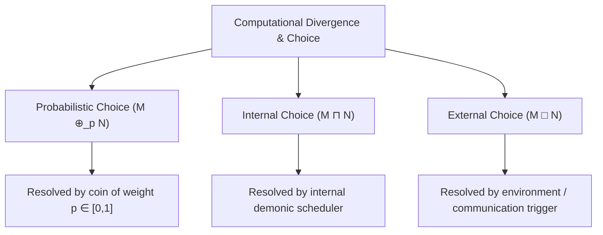
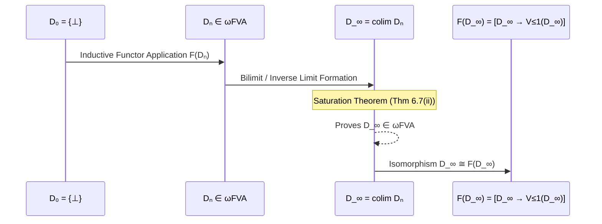
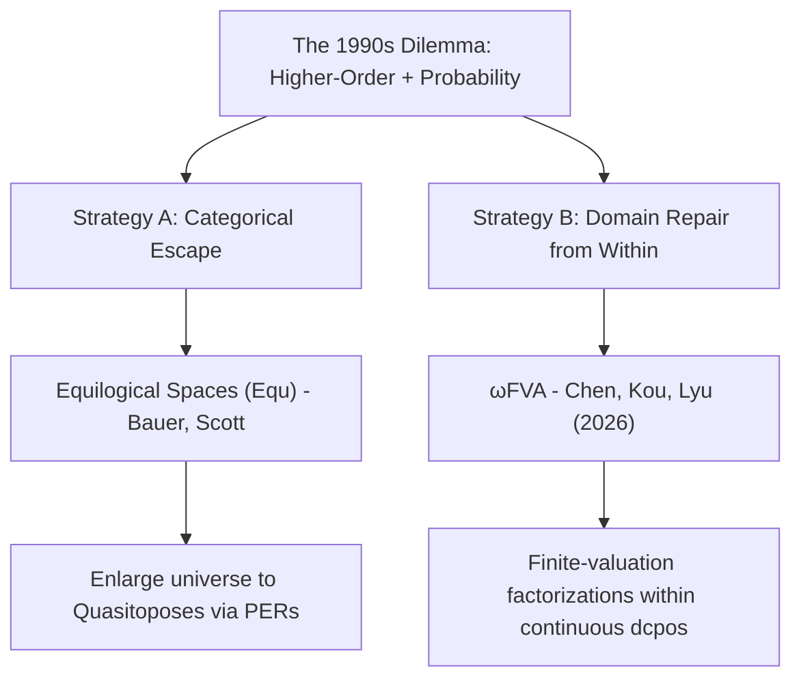
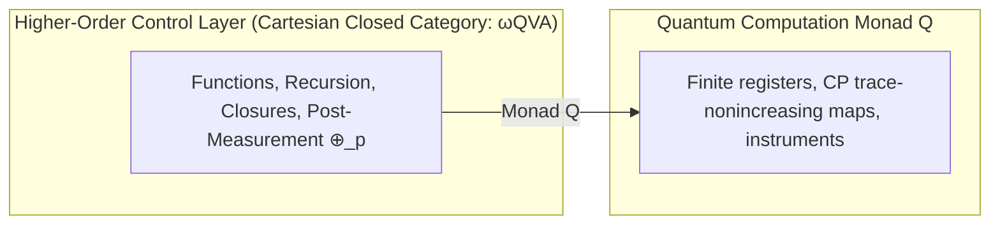
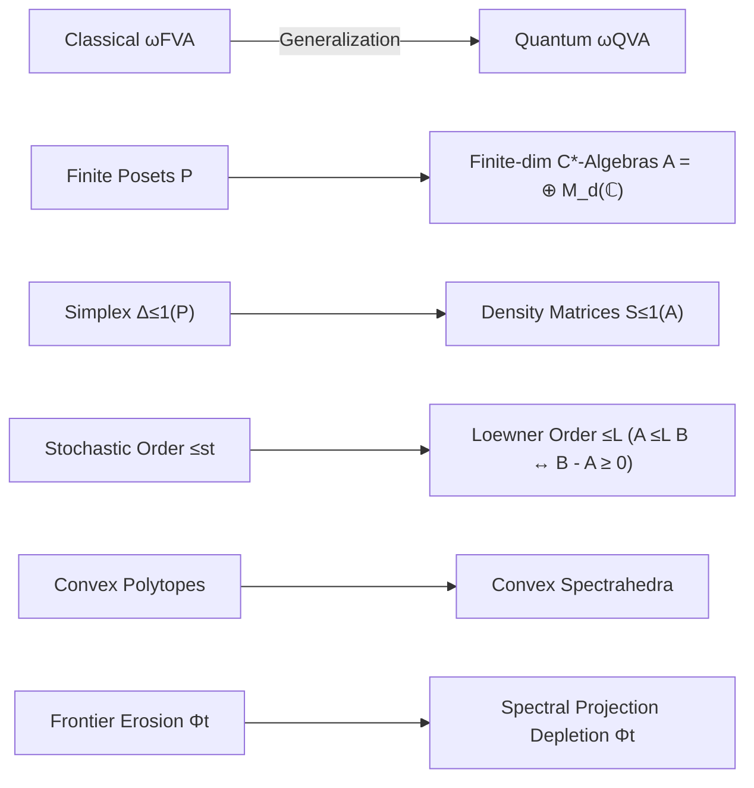

# Finite-Valuation Approximable Structures, Quantum $\lambda$-Calculus, and the Jung–Tix Problem: Semantics and Formal Verification in Lean 4


---

### Abstract
We develop a Lean 4 framework toward denotational semantics for an untyped $\lambda$-calculus with probabilistic, internal, and external choice, controlled by finite quantum instruments. Inspired by Chen, Kou, and Lyu’s finite-valuation approximable structures, we define $\omega\mathbf{QVA}$ by requiring its approximate identity to factor through finite products of sub-normalized density-operator spaces with the Loewner order. The finite spectrahedra are approximation factors; they are not themselves a quantum powerdomain $\mathcal Q(D)$. We formalize a parameterized inverse-limit theorem: any locally continuous endofunctor $\mathcal Q$ that preserves $\omega\mathbf{QVA}$ yields a solution of $D_\infty\cong[D_\infty\to\mathcal Q(D_\infty)]$. This theorem does not by itself supply such a quantum endofunctor. The concrete route developed here starts from Kraus-presented completely positive trace-nonincreasing maps and finite instruments, with untyped $\lambda$-calculus providing classical higher-order control over a finite quantum register. The accompanying $q\lambda$/Qiskit tables state an observational correspondence: matching operational realizations must induce the same outcome probabilities and conditional post-measurement states. Constructing the continuous instrument powerdomain and proving that it satisfies the abstract endofunctor specification remain the principal open steps.

---

## 1. Introduction and Background

The Scott–Strachey programme for denotational semantics models computation in untyped $\lambda$-calculus by solving reflexive domain equations of the form $D \cong [D \to D]$. In concurrent and non-deterministic computation, powerdomains (Plotkin, Smyth, Hoare) model internal non-determinism ($\sqcap$) and external interactive choice ($\Box$). In probabilistic extensions (pCSP) and higher-order probabilistic programming, randomized branching is quantified via the subprobability valuation powerdomain $\mathcal{V}_{\le 1}$.

Giving a rigorous denotational semantics to untyped higher-order languages with probabilistic choice requires solving recursive domain equations of the form:
$$D \cong [D \to \mathcal{P}(\mathcal{V}_{\le 1}(D))]$$
This requires a category that is simultaneously **Cartesian closed** (to interpret function spaces $[D \to \dots]$) and **closed under $\mathcal{V}_{\le 1}$**. In 1998, Achim Jung and Regina Tix identified a persistent obstruction: standard Cartesian closed categories of continuous domains (such as bifinite domains, RB-domains, and FS-domains) were not known to be preserved by $\mathcal{V}_{\le 1}$.

In August 2026, Chen, Kou, and Lyu resolved the Jung–Tix problem by introducing the category $\omega\mathbf{FVA}$ (Finite-Valuation Approximable domains), establishing the first full Cartesian closed subcategory of continuous domains closed under $\mathcal{V}_{\le 1}$ and $\mathcal{V}_1$.

---

## 2. Syntactic Extension: Untyped $\lambda$-Calculus with Choice Operators

We extend the untyped $\lambda$-calculus with the three canonical choice operators from concurrent and probabilistic process calculi:

$$M, N ::= x \mid \lambda x. M \mid M \, N \mid M \oplus_p N \mid M \sqcap N \mid M \mathbin{\Box} N$$



### The Three Choice Operators
1. **Probabilistic Choice ($M \oplus_p N$):**
   * **Behavior:** A coin weighted by $p \in [0, 1]$ is flipped at reduction time; the term reduces to $M$ with probability $p$ and to $N$ with probability $1 - p$.
   * **Found in:** Probabilistic $\lambda$-calculus, Probabilistic PCF (Plotkin 1989, Jones 1990, Dal Lago, Ehrhard et al.).
2. **Internal Nondeterministic Choice ($M \sqcap N$ or $M \oplus N$):**
   * **Behavior:** Unpredictable, unobservable scheduling or arbitrary choice between two functions/expressions.
   * **Found in:** De’Liguoro–Piperno’s non-deterministic $\lambda$-calculus, Boudol’s concurrent $\lambda$-calculus.
3. **External / Interactive Choice ($M \mathbin{\Box} N$ or Guarded Selection):**
   * **Behavior:** Waiting for the environment (e.g., awaiting a message on a communication channel or waiting for an argument/input event).
   * **Canonical functional equivalent:** The `select` construct in Concurrent ML (CML) or guarded alternative evaluation:
     $$\text{sync}(\text{receive}(c_1) \Rightarrow \lambda x. M \;\mathbin{\Box}\; \text{receive}(c_2) \Rightarrow \lambda y. N)$$

To give this calculus a denotational semantics, one must solve:
$$D \cong [D \to \mathcal{P}(\mathcal{V}_{\le 1}(D))]$$
where $[D \to \dots]$ models higher-order functions, $\mathcal{P}$ models internal choice ($\sqcap$), and $\mathcal{V}_{\le 1}$ models probabilistic choice ($\oplus_p$).

---

## 3. Solving Recursive Domain Equations in $\omega\mathbf{FVA}$

The category $\omega\mathbf{FVA}$ consists of continuous domains $D$ whose identity map is the directed supremum of an increasing sequence of maps factoring through subprobability valuation spaces over finite posets $P_n$:
$$D \xrightarrow{\;p_n\;} \mathcal{V}_{\le 1}(P_n) \xrightarrow{\;e_n\;} D, \qquad \sup_{n \in \mathbb{N}} (e_n \circ p_n) = \mathrm{id}_D$$

The Smyth–Plotkin embedding-projection ($e$-$p$) method proceeds in five steps:



### Step 1: Establish the Ambient Cartesian Closed Category ($\omega\mathbf{FVA}$)
By Theorem 10.4 of Chen–Kou–Lyu (2026):
* **Initial / Pointed Object:** $\bot \in D$ exists for all $D \in \omega\mathbf{FVA}$, and the terminal domain $\mathbb{I} = \{\bot\} = \mathcal{V}_{\le 1}(\emptyset)$ is in $\omega\mathbf{FVA}$.
* **Cartesian Closure:** If $X, Y \in \omega\mathbf{FVA}$, then $[X \to Y] \in \omega\mathbf{FVA}$.
* **Probabilistic Closure:** If $X \in \omega\mathbf{FVA}$, then $\mathcal{V}_{\le 1}(X) \in \omega\mathbf{FVA}$ and $\mathcal{V}_1(X) \in \omega\mathbf{FVA}$.

Therefore, the mixed-variance endofunctor $F(X) = [X \to \mathcal{V}_{\le 1}(X)]$ is well-defined internally on $\omega\mathbf{FVA}$.

### Step 2: Build the Approximation Chain via Embedding-Projection Pairs
An embedding-projection pair $(e, p)$ satisfies $p \circ e = \mathrm{id}_X$ and $e \circ p \le \mathrm{id}_Y$.
* **Base stage:** $D_0 = \{\bot\}$.
* **Inductive stages:** $D_{n+1} = F(D_n) = [D_n \to \mathcal{V}_{\le 1}(D_n)] \in \omega\mathbf{FVA}$.
* **Lifting:** 
  $$e_{n+1} = F(e_n, p_n) = [p_n \to \mathcal{V}_{\le 1}(e_n)] : D_{n+1} \to D_{n+2}$$
  $$p_{n+1} = F(p_n, e_n) = [e_n \to \mathcal{V}_{\le 1}(p_n)] : D_{n+2} \to D_{n+1}$$
  yielding the expanding chain: $D_0 \rightleftarrows D_1 \rightleftarrows D_2 \rightleftarrows \dots \rightleftarrows D_n \rightleftarrows \dots$

### Step 3: Take the Bilimit / Colimit $D_\infty$
In $\mathbf{DCPO}$, the bilimit is the standard inverse limit:
$$D_\infty = \left\{ (x_n)_{n \in \mathbb{N}} \in \prod_{n \in \mathbb{N}} D_n \;\middle|\; \forall n, \, x_n = p_n(x_{n+1}) \right\}$$
equipped with canonical limiting pairs $(e_n^\infty : D_n \to D_\infty, \, p_n^\infty : D_\infty \to D_n)$ satisfying $p_n^\infty \circ e_n^\infty = \mathrm{id}_{D_n}$, $e_n^\infty \circ p_n^\infty \le e_{n+1}^\infty \circ p_{n+1}^\infty \le \mathrm{id}_{D_\infty}$, and $\sup_{n \in \mathbb{N}} (e_n^\infty \circ p_n^\infty) = \mathrm{id}_{D_\infty}$.

### Step 4: Proving $D_\infty \in \omega\mathbf{FVA}$ (The Saturation Theorem)
By Theorem 6.7(ii) (Unified Kernel-Lifting / Saturation Theorem):
> If $D$ is a domain with an increasing sequence $a_n = e_n p_n \le \mathrm{id}_D$ such that $\sup_n a_n = \mathrm{id}_D$ factoring through $B_n \in \omega\mathbf{FVA}$, then **$D \in \omega\mathbf{FVA}$**.

Setting $B_n = D_n \in \omega\mathbf{FVA}$ and $a_n = e_n^\infty \circ p_n^\infty$, Theorem 6.7(ii) guarantees **$D_\infty \in \omega\mathbf{FVA}$**.

### Step 5: Establish the Isomorphism $D_\infty \cong [D_\infty \to \mathcal{V}_{\le 1}(D_\infty)]$
Because $F$ preserves directed suprema of embedding-projection pairs:
$$F(D_\infty) = F\left(\operatorname{colim}_n D_n\right) \cong \operatorname{colim}_n F(D_n) = \operatorname{colim}_n D_{n+1} \cong D_\infty$$
Thus, $D_\infty \cong [D_\infty \to \mathcal{V}_{\le 1}(D_\infty)]$ in $\omega\mathbf{FVA}$.

---

## 4. Comparison: $\omega\mathbf{FVA}$ vs. Equilogical Spaces ($\mathbf{Equ}$)

In the late 1990s, semanticists recognized that continuous domains ($\mathbf{CONT}$) failed Cartesian closure and that standard CCC subclasses were not closed under probabilistic valuations. This led to two historical pathways:



1. **Strategy A — Equilogical Spaces ($\mathbf{Equ}$):** Formed by pairs $(X, \sim)$ of $T_0$ spaces with equivalence relations. $\mathbf{Equ}$ is a quasitopos (locally Cartesian closed, handles quotients and sheaves). The trade-off is losing concrete order-theoretic approximations and working with realizers.
2. **Strategy B — $\omega\mathbf{FVA}$:** Retains pure continuous dcpos with Scott topologies and the way-below relation ($\ll$). It resolves the obstruction by replacing finite-image deflations with finite-valuation factorizations ($D \to \mathcal{V}_{\le 1}(P_n) \to D$).
3. **Categorical Embedding:** Every countably based domain in $\omega\mathbf{FVA}$ embeds fully and faithfully into $\mathbf{Equ}$ as $(D, =_D)$:
   $$\omega\mathbf{FVA} \hookrightarrow \omega\mathbf{FS}_\bot \hookrightarrow \mathbf{Equ}$$

### Comparison Table

| Feature | Equilogical Spaces ($\mathbf{Equ}$) | Finite-Valuation Domains ($\omega\mathbf{FVA}$) |
| :--- | :--- | :--- |
| **Mathematical Nature** | Topological spaces + Equivalence relations (Quasitopos) | Partially ordered sets (Continuous DCPOs / FS-domains) |
| **Cartesian Closed?** | **Yes** (by categorical design) | **Yes** (Theorem 10.4) |
| **Probabilistic Monads?** | **Yes** (via realizability/sheaves) | **Yes** ($\mathcal{V}_{\le 1}, \mathcal{V}_1$ are internal functors) |
| **Approximation Theory** | Realizers / Moduli of continuity | Way-below relation ($\ll$) & finite posets $P_n$ |
| **Philosophical Role** | Higher-order probability in topological/categorical logic | Higher-order probability in classical domain theory |

---

## 5. The Quantum Extension: From Classical Probability to $\omega\mathbf{QVA}$

In quantum mechanics, unitary evolution creates coherent superposition, while measurement turns that coherence into a classical distribution of outcomes. For a computational-basis measurement,

$$\alpha\vert 0 \rangle + \beta\vert 1 \rangle
  \xrightarrow{\{\rho\mapsto P_i\rho P_i\}_{i=0,1}}
  \begin{cases}
    0 & \text{with probability } |\alpha|^2,\\
    1 & \text{with probability } |\beta|^2.
  \end{cases}$$

The superposition before measurement is not the probabilistic term $M\oplus_p N$: the latter denotes classical randomized control. Internal scheduler choice $M\sqcap N$ and external guarded choice $M\mathbin{\Box}N$ are two further, independent effects. They do not occur as successive stages after measurement.

### The No-Cloning Barrier and the LNL Architecture
Because the **No-Cloning Theorem** ($|\psi\rangle \not\to |\psi\rangle \otimes |\psi\rangle$) forbids diagonal copy maps $\Delta = \langle \mathrm{id}, \mathrm{id} \rangle$, pure quantum states cannot live directly in a Cartesian Closed Category. Instead, following Selinger and Valiron (2006/2009), we employ a **Linear-Nonlinear (LNL) / Monadic architecture**:



### Generalizing to $\omega\mathbf{QVA}$
We generalize the Chen–Kou–Lyu construction from commutative probability simplices to non-commutative density operator spaces:



1. **Finite State Spaces:** Let $A = \bigoplus_{k=1}^m M_{d_k}(\mathbb{C})$. Its sub-normalized density operator space is $\mathcal{S}_{\le 1}(A) = \{ \rho \in A^*_+ \mid \operatorname{Tr}(\rho) \le 1 \}$ equipped with the Loewner partial order $\rho \le_L \sigma \iff \sigma - \rho \ge 0$.
2. **Spectral Depletion Semigroup:** For $\rho = \sum \lambda_i E_i$, $\Phi_t(\rho)$ scales down maximal eigenspace projections, preserving the Loewner order ($\rho \le_L \sigma \implies \Phi_t(\rho) \le_L \Phi_t(\sigma)$) and establishing that $\mathcal{S}_{\le 1}(A)$ is an FS-domain.
3. **Definition ($\omega\mathbf{QVA}$):** A domain $D$ is in $\omega\mathbf{QVA}$ if $\mathrm{id}_D = \sup_n a_n$ where each $a_n$ factors through $\mathcal{S}_{\le 1}(A_n)$ for finite-dimensional $C^*$-algebras $A_n$.
4. **Saturation:** The 2-level flattening lemma (Lemma 6.6) depends only on way-below interpolation ($\ll$) and finite separation, so the bilimit $D_\infty = \operatorname{colim}_n D_n$ lies in $\omega\mathbf{QVA}$. The isomorphism $D_\infty \cong [D_\infty \to \mathcal{Q}(D_\infty)]$ additionally requires a locally continuous endofunctor $\mathcal{Q}$ on $\omega\mathbf{QVA}$.

### Instruments as the quantum effect

The finite spectrahedron $\mathcal{S}_{\le 1}(A)$ is the approximating factor in the definition of $\omega\mathbf{QVA}$, analogous to $\mathcal{V}_{\le 1}(P)$ for a finite poset $P$. It is not itself an element of $\mathcal{Q}(D)$ for a general continuous lattice $D$. Jones and Plotkin define $\mathcal{V}_{\le 1}(D)$ as continuous valuations on Scott-opens; Selinger and Valiron’s $Q$ is a linear/monadic type constructor. Neither source fixes a unique endofunctor $\mathcal{Q}$ on continuous lattices.

Scott’s inverse-limit machine solves $D_\infty \cong [D_\infty \to \mathcal{Q}(D_\infty)]$ for *any* locally continuous endofunctor $\mathcal{Q}$ that preserves $\omega\mathbf{QVA}$. This is a conditional domain-theoretic theorem, not a construction of the required quantum effect. The stand-ins $\mathcal{Q}(D) := D$ and $\mathcal{Q}(D) := \mathcal{V}_{\le 1}(D)$ do not model quantum computation. The constant choice $\mathcal{Q}(D) := \mathcal{S}_{\le 1}(A)$ for fixed finite $A$ is a quantum ground type, not a powerdomain of computations returning values in $D$.

**Working concrete route.** Fix a finite quantum register. A quantum operation is represented by Kraus operators $\{K_i\}$ and acts by
$$\Phi(\rho)=\sum_i K_i\rho K_i^\dagger,$$
subject to trace non-increase. A finite instrument is a finite family $(\Phi_o)_o$ whose sum is trace non-increasing; measurement probabilities are $\operatorname{Tr}(\Phi_o(\rho))$, and normalization gives the conditional post-measurement state. Finite instruments are ordered by a weakest-precondition/TT refinement quantified over monotone Kraus-valued postconditions. Residual CP refinement makes this order presentation-independent and stable under monotone value-dependent quantum continuations; unit, pushforward, and bind congruence are proved before antisymmetrization. `InstrumentPower n D` takes the Scott-closed Hoare completion of that finite basis: its elements are lower sets closed under every directed supremum that exists in the basis, and joins apply Scott closure after union. The closure system and its complete-lattice structure are formalized generically in `QLambda/ScottLowerSet.lean`. Scott closure can repair false compactness and may repair local continuity once the TT observations themselves preserve directed outcome limits. It cannot, however, repair $\omega\mathbf{QVA}$ for registers of dimension at least two while exact CP instruments remain the approximating basis: uncountably many distinct rank-one Choi rays have no shared nonzero lower CP approximation, whereas a countable sequence of finite separators can cover only countably many such rays. The replacement basis now starts in `QLambda/RationalComplex.lean` and `QLambda/ObservationBasis.lean`: Gaussian-rational Choi vectors and strict rational thresholds are countable, arbitrary Scott-open output tests keep the carrier independent of an $\omega\mathbf{QVA}$ witness, and a separately coded output family yields countable finite conjunctions. An atom asserts $q<v^\dagger J_\mu(U)v$; strictness is essential because equality may first appear at a directed limit.

**Spec (`IsQuantumPowerModel`).** A *quantum powerdomain model* is an assignment $Q$ of types to complete lattices such that:

1. $Q(D)$ is a complete lattice whenever $D$ is;
2. $Q$ is a functor on Scott maps ($Q(\mathrm{id}) = \mathrm{id}$, $Q(f \circ g) = Q(f) \circ Q(g)$);
3. $Q$ is order-enriched and locally continuous on monotone $\mathbb{N}$-families ($f \le g$ implies $Q(f) \le Q(g)$, and $Q(\bigsqcup_n F_n) = \bigsqcup_n Q(F_n)$), so projections lift and $i_\infty \circ j_\infty = \mathrm{id}$ collapses;
4. $D \in \omega\mathbf{QVA}$ implies $Q(D) \in \omega\mathbf{QVA}$.

A bundled `QuantumPowerModel` is a $Q$ together with an instance of this specification. No concrete instance is presently bundled. Cartesian closure of $[D \to E]$ is independent of $Q$; the Lean proof constructs finite joins of step maps sampled at the finite separators of $D$ and uses the approximants of $E$.

**Theorem (parameterized).** Let $Q$ be an instance of the spec, let $D_0 \in \omega\mathbf{QVA}$, and let $j_0 : [D_0 \to Q(D_0)] \to D_0$ be a continuous lattice projection. Let $D_\infty$ be the inverse limit of $D_{n+1} = [D_n \to Q(D_n)]$. Then $D_\infty \in \omega\mathbf{QVA}$ and $D_\infty \cong [D_\infty \to Q(D_\infty)]$.

The mixed tower maps and the isomorphism identities are proved from the specification. A concrete instrument corollary will be stated only after the instrument powerdomain discharges every field.

---

## 6. Back-and-Forth Operational Correspondence with Qiskit

The tables in this section ground the denotational semantics by relating two operational presentations. They are not intended as a literal compiler specification. Each row is a commuting correspondence

$$\text{$q\lambda$ construct}\longrightarrow
  \text{CP channel or instrument}
  \longleftarrow\text{Qiskit execution pattern}.$$

For a fixed initial quantum state, the desired equivalence is observational: both sides have the same classical outcome probabilities and, conditioned on an outcome, the same post-measurement quantum state. The quantum forms below are intended primitives extending the classical control syntax of §2; they are not Church encodings. Church booleans remain useful classical data, but they are duplicable and therefore cannot stand for qubits.

### Table 1: Quantum primitives with a shared denotation
| Concept | Intended $q\lambda$ operational form | Qiskit execution pattern | Shared CP denotation |
| :--- | :--- | :--- | :--- |
| **Prepare $\vert0\rangle$** | $\operatorname{new0}(q);\,M$ | `qc.reset(q)` (or a fresh circuit qubit) | Preparation channel with output $\vert0\rangle\langle0\vert$ |
| **Pauli-$X$** | $X(q);\,M$ | `qc.x(q)` | $\rho\mapsto X\rho X^\dagger$ |
| **Prepare $\vert1\rangle$** | $\operatorname{new0}(q);\,X(q);\,M$ | fresh/reset `q`; `qc.x(q)` | Preparation channel with output $\vert1\rangle\langle1\vert$ |
| **Hadamard** | $H(q);\,M$ | `qc.h(q)` | $\rho\mapsto H\rho H^\dagger$; on $\vert0\rangle$ the output is coherent $\vert+\rangle$, not a probabilistic mixture |
| **CNOT** | $\operatorname{CX}(q,r);\,M$ | `qc.cx(q, r)` | $\rho\mapsto \operatorname{CX}\rho\operatorname{CX}^\dagger$ |
| **Measurement** | $\operatorname{measure}\ q\ \operatorname{with}\ 0\Rightarrow M\mid1\Rightarrow N$ | `qc.measure(q, c)` followed by `if_test` branches | Instrument $\Phi_i(\rho)=P_i\rho P_i$; probability $\operatorname{Tr}(\Phi_i(\rho))$ |
| **Classical probabilistic choice** | $M\oplus_p N$ | host RNG, or an ancilla rotation followed by measurement and `if_test` | Branches $p\,\mathrm{id}$ and $(1-p)\,\mathrm{id}$ followed by the denotations of $M,N$ |

### Table 2: Higher-order control and choice
| Concept | $q\lambda$ operational role | Qiskit / host-language counterpart | Denotational correspondence |
| :--- | :--- | :--- | :--- |
| **Variable** | $x$ is classical data or an opaque register handle | Python parameter, classical value, or register index | Environment lookup; a quantum register is threaded by the instrument semantics rather than copied as a Church value |
| **Abstraction** | $\lambda x.M$ packages higher-order classical control | circuit factory, closure, or parameterized subroutine | Scott-continuous function producing a computation; not necessarily a unitary |
| **Application** | $M\,N$ invokes higher-order control | call a factory/subroutine and compose its result | Evaluation followed by Kleisli/instrument composition |
| **Probabilistic choice** | $M\oplus_p N$ resolves by a classical coin | host RNG or measured ancilla controlling dynamic branches | Convex combination of the two computation denotations |
| **Internal choice** | $M\sqcap N$ is selected by an unobservable scheduler | host/runtime scheduler chooses a branch | Nondeterministic powerdomain layer; no fixed 50/50 probability is implied |
| **External choice** | $M\mathbin{\Box}N$ waits for an environment-selected guard/event | runtime input, callback, or guarded `if_test` | Environment-indexed family of computations; not inherently a controlled unitary |

Thus the “back-and-forth” is between operational realizations at matching semantic layers. Quantum gates and measurements meet as channels and instruments. Untyped $\lambda$ abstraction and application meet Qiskit through the surrounding classical host language as circuit-producing higher-order control. Some terms require dynamic circuits or runtime interaction rather than one static circuit, but the common denotation still supplies the mental bijection used to guide the formal semantics.

---

## 7. Formal Verification in Lean 4 & Capstone Theorem

The formalization is constructed in Lean 4 on top of the `Scott1972` continuous lattice library (`https://github.com/catskillsresearch/scott1972`). Chen–Kou–Lyu-style finite-separation and saturation lemmas are mechanized in `QLambda/Saturation.lean`, and `omegaQVA_closed_under_functionSpace` proves Cartesian closure by finite-separator step-map sampling. The compared capstone `omegaQVA_quantum_domain_equation_solved` is parameterized by a bundled `QuantumPowerModel`; no concrete instance is claimed. `QLambda/QuantumInstrument.lean` develops the finite computational layer: Kraus operator-sum (composition, positivity, Loewner monotonicity, isometries), Choi denotations, extensional and residual CP refinement, sequential composition of trace-nonincreasing operations, action on sub-normalized densities, and a Type-level monad `FiniteInstrumentComp` of finite instruments with classical outcomes in `D`. Pauli-$X$ and computational-basis measurement are instances. `QLambda/InstrumentPower.lean` defines monotone Kraus-valued postconditions, weakest-precondition aggregation, TT refinement, and finite unit/map/bind congruence. `QLambda/ScottLowerSet.lean` constructs the Scott-closed lower carrier as the closed points of an explicit closure operator, proves its complete-lattice structure, and proves direct-image identity and composition whenever basis maps preserve existing directed suprema. `QLambda/ObservationBasis.lean` adds universal and countably coded Scott-open output observations, strict rational Choi atoms, finite-token semantic entailment, Choi positivity and monotonicity. Gaussian-rational quadratic tests are proved to separate Hermitian Choi matrices by finite-dimensional polarization using $e_p$, $e_p+e_q$, and $e_p+i e_q$. Every $\omega\mathbf{QVA}$ witness is also proved to induce a countable cofinal output basis: the coded elements are iterated approximants of finite-separator points and their way-above sets refine every Scott-open neighbourhood. This is not yet the required model: saturating token theories and lifting map/bind remain open.

```lean
class IsQuantumPowerModel (Q : (D : Type u) → [CompleteLattice D] → Type u) where
  str : ∀ D [CompleteLattice D], CompleteLattice (Q D)
  map : ∀ {D E} [CompleteLattice D] [CompleteLattice E], ScottMap D E → ScottMap (Q D) (Q E)
  map_id : ...
  map_comp : ...
  map_mono : ...
  map_iSup : ...
  closed : ∀ {D} [CompleteLattice D], IsOmegaQVA D → IsOmegaQVA (Q D)

theorem omegaQVA_quantum_domain_equation_solved
    (M : QuantumPowerModel) (D₀ : QDomain.{u})
    (j₀ : IsContinuousLatticeProjection D₀.carrier (QuantumFunctor M D₀.carrier)) :
    Nonempty (IsOmegaQVA (QDInf M D₀ j₀)) ∧
    ... ∧
    Nonempty (QDInf M D₀ j₀ ≃o ScottMap (QDInf M D₀ j₀) (QuantumPower M (QDInf M D₀ j₀)))

structure QuantumOperation (n m : ℕ) where
  kraus : List (Matrix (Fin m) (Fin n) ℂ)
  trace_nonincreasing : ...

structure QuantumInstrument (n m outcomes : ℕ) where
  branch : Fin outcomes → List (Matrix (Fin m) (Fin n) ℂ)
  trace_nonincreasing : ...

structure FiniteInstrumentComp (n : ℕ) (D : Type*) where
  Outcome : Type
  [outcomeFintype : Fintype Outcome]
  branch : Outcome → List (Matrix (Fin n) (Fin n) ℂ)
  value : Outcome → D
  trace_nonincreasing : ...
```

---

## 8. Acknowledgments & Provenance

* **Software & AI Tooling:** The formalization was mechanized using **Lean 4** and **Mathlib**. The author utilized the **Cursor** development environment, **Grok 4.6 High Fast**, **Gemini 3.7 Flash**, and **GPT-5.6 Sol Medium** as assistive tools for code scaffolding, proof exploration, semantic review, redesign planning, and document drafting.
* **Integrity Statement:** All formal definitions, proofs, and synthesized results were verified under the Lean 4 compiler. Authors retain full and exclusive responsibility for the mathematical correctness of the mechanized proofs and the contents of this manuscript.

---

## References

1. S. Abramsky and B. Coecke. *A categorical semantics of quantum protocols*. In *Proceedings of the 19th Annual IEEE Symposium on Logic in Computer Science (LICS)*, pages 415–425, 2004.
2. P. N. Benton. *A mixed linear and non-linear logic: Proofs, terms and models*. In *Computer Science Logic (CSL)*, LNCS 933, pages 121–135. Springer, 1995.
3. Y. Chen, H. Kou, and Z. Lyu. *Finite-valuation approximable structures: a solution to the Jung–Tix problem of probabilistic powerdomains*. arXiv:2608.03073, 2026.
4. G. Gierz, K. H. Hofmann, K. Keimel, J. D. Lawson, M. Mislove, and D. S. Scott. *Continuous Lattices and Domains*. Cambridge University Press, Cambridge, 2003.
5. C. Jones and G. D. Plotkin. *A probabilistic powerdomain of evaluations*. In *Proceedings of the 4th Annual IEEE Symposium on Logic in Computer Science (LICS)*, pages 186–195, 1989.
6. A. Jung and R. Tix. *The troublesome probabilistic powerdomain*. *Electronic Notes in Theoretical Computer Science*, 13:70–91, 1998.
7. D. S. Scott. *Continuous lattices*. In *Toposes, Algebraic Geometry and Logic*, Lecture Notes in Mathematics, vol. 274, pages 97–136. Springer, Berlin, 1972.
8. P. Selinger and B. Valiron. *A linear-non-linear model for a quantum lambda calculus*. *Information and Computation*, 207(5):603–629, 2009.
9. M. B. Smyth and G. D. Plotkin. *The category-theoretic solution of recursive domain equations*. *SIAM Journal on Computing*, 11(4):761–783, 1982.
10. M. Ying. *Foundations of Quantum Programming*. Morgan Kaufmann / Elsevier, 2016.