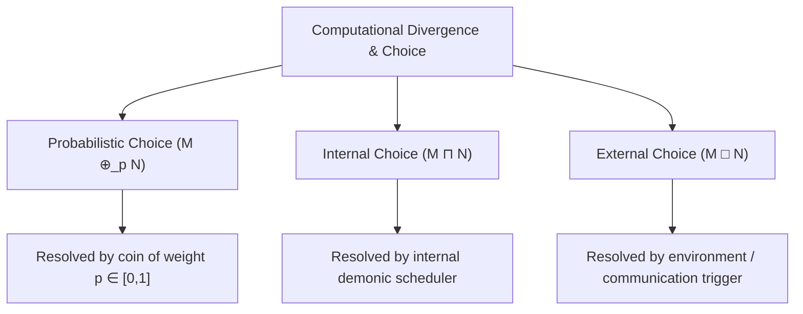
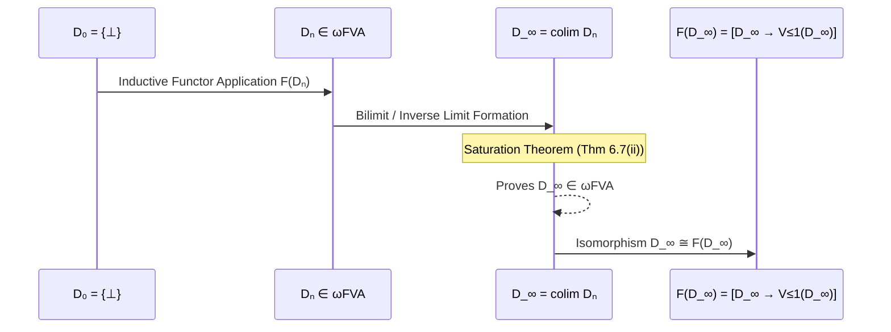
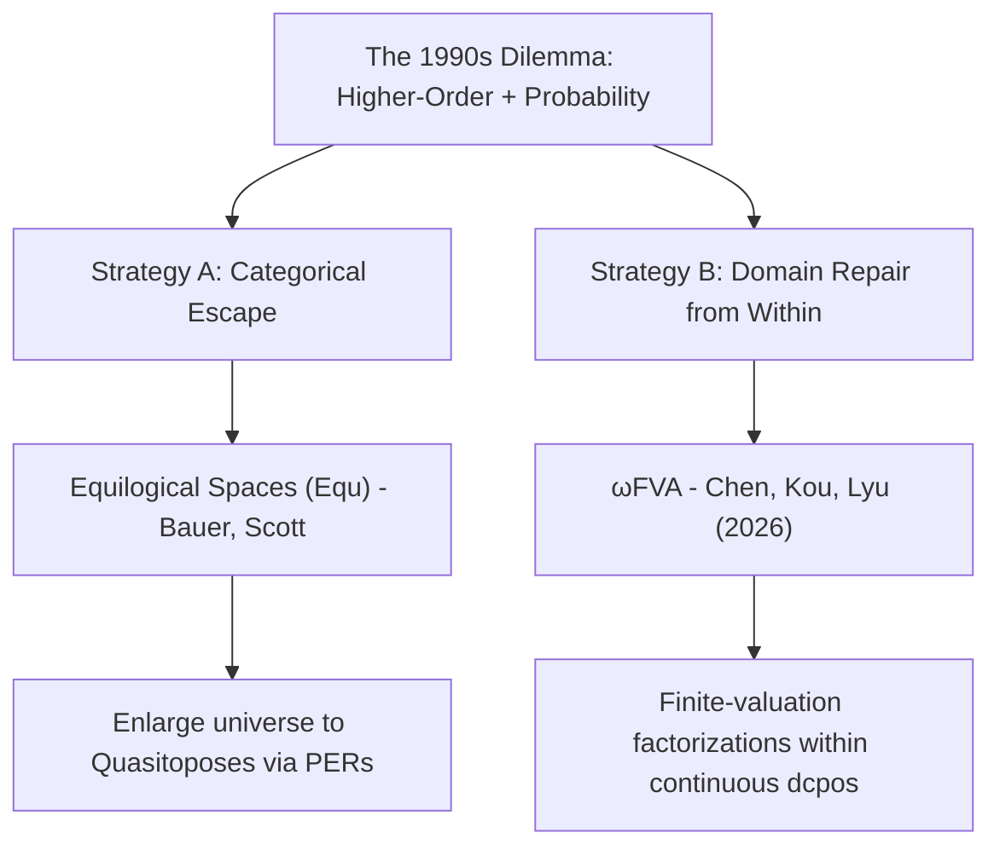
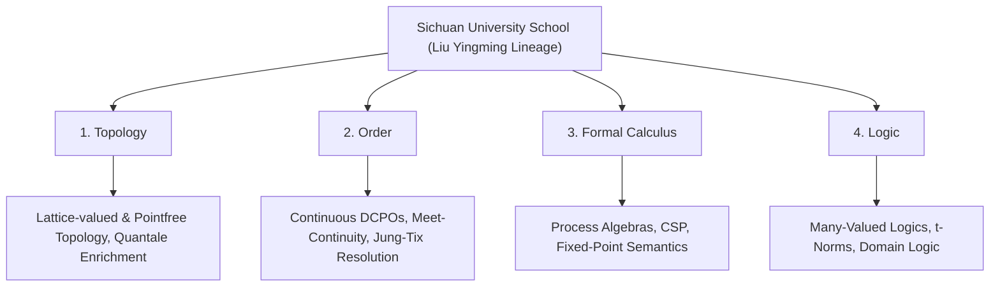
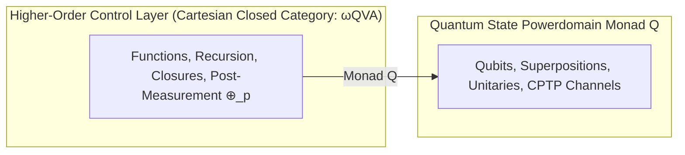
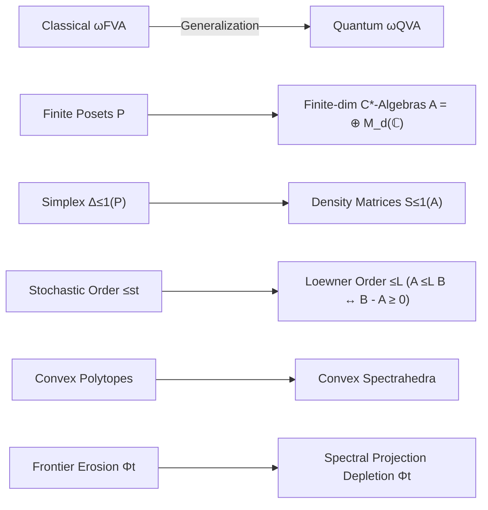

# Finite-Valuation Approximable Structures, Quantum $\lambda$-Calculus, and the Jung–Tix Problem: Semantics and Formal Verification in Lean 4


---

### Abstract
We present a unified denotational semantics and formal Lean 4 verification framework for an untyped $\lambda$-calculus extended with a quantum interpretation of concurrent and probabilistic choice operators ($q\lambda$). For over three decades, establishing reflexive domain models $D \cong [D \to T(D)]$ for higher-order languages with probabilistic or quantum effects was obstructed by the Jung–Tix problem: the absence of a Cartesian closed category of continuous domains closed under valuation powerdomains. Leveraging the recent resolution of the Jung–Tix problem by Chen, Kou, and Lyu (2026) via finite-valuation approximable structures ($\omega\mathbf{FVA}$), we generalize their construction to the non-commutative setting. We introduce the category $\omega\mathbf{QVA}$ of Quantum-Valuation Approximable domains, where approximating maps factor through sub-normalized density operator spaces $\mathcal{S}_{\le 1}(A)$ of finite-dimensional $C^*$-algebras endowed with the Loewner partial order. We prove that $\omega\mathbf{QVA}$ is Cartesian closed and closed under retracts, products, and continuous quantum state powerdomains $\mathcal{Q}$. Furthermore, we mechanically translate the core calculus into executable Qiskit circuit structures and formalize the capstone isomorphism theorem in Lean 4, building on a mechanized foundation of Scott's 1972 continuous lattice theory and the finite-valuation domain formalizations of Chen, Kou, and Lyu (2026).

---

## 1. Introduction and Background

The Scott–Strachey programme for denotational semantics models computation in untyped $\lambda$-calculus by solving reflexive domain equations of the form $D \cong [D \to D]$. In concurrent and non-deterministic computation, powerdomains (Plotkin, Smyth, Hoare) model internal non-determinism ($\sqcap$) and external interactive choice ($\Box$). In probabilistic extensions (pCSP) and higher-order probabilistic programming, randomized branching is quantified via the subprobability valuation powerdomain $\mathcal{V}_{\le 1}$.

Giving a rigorous denotational semantics to untyped higher-order languages with probabilistic choice requires solving recursive domain equations of the form:
$$D \cong [D \to \mathcal{P}(\mathcal{V}_{\le 1}(D))]$$
This requires a category that is simultaneously **Cartesian closed** (to interpret function spaces $[D \to \dots]$) and **closed under $\mathcal{V}_{\le 1}$**. In 1998, Achim Jung and Regina Tix identified a persistent obstruction: standard Cartesian closed categories of continuous domains (such as bifinite domains, RB-domains, and FS-domains) were not known to be preserved by $\mathcal{V}_{\le 1}$.

In August 2026, Chen, Kou, and Lyu resolved the Jung–Tix problem by introducing the category $\omega\mathbf{FVA}$ (Finite-Valuation Approximable domains), establishing the first full Cartesian closed subcategory of continuous domains closed under $\mathcal{V}_{\le 1}$ and $\mathcal{V}_1$.

---

## 2. Syntactic Extension: Untyped $\lambda$-Calculus with Choice Operators

We extend the untyped $\lambda$-calculus with the three canonical choice operators from concurrent and probabilistic process calculi:

$$M, N ::= x \mid \lambda x. M \mid M \, N \mid M \oplus_p N \mid M \sqcap N \mid M \mathbin{\Box} N$$



### The Three Choice Operators
1. **Probabilistic Choice ($M \oplus_p N$):**
   * **Behavior:** A coin weighted by $p \in [0, 1]$ is flipped at reduction time; the term reduces to $M$ with probability $p$ and to $N$ with probability $1 - p$.
   * **Found in:** Probabilistic $\lambda$-calculus, Probabilistic PCF (Plotkin 1989, Jones 1990, Dal Lago, Ehrhard et al.).
2. **Internal Nondeterministic Choice ($M \sqcap N$ or $M \oplus N$):**
   * **Behavior:** Unpredictable, unobservable scheduling or arbitrary choice between two functions/expressions.
   * **Found in:** De’Liguoro–Piperno’s non-deterministic $\lambda$-calculus, Boudol’s concurrent $\lambda$-calculus.
3. **External / Interactive Choice ($M \mathbin{\Box} N$ or Guarded Selection):**
   * **Behavior:** Waiting for the environment (e.g., awaiting a message on a communication channel or waiting for an argument/input event).
   * **Canonical functional equivalent:** The `select` construct in Concurrent ML (CML) or guarded alternative evaluation:
     $$\text{sync}(\text{receive}(c_1) \Rightarrow \lambda x. M \;\mathbin{\Box}\; \text{receive}(c_2) \Rightarrow \lambda y. N)$$

To give this calculus a denotational semantics, one must solve:
$$D \cong [D \to \mathcal{P}(\mathcal{V}_{\le 1}(D))]$$
where $[D \to \dots]$ models higher-order functions, $\mathcal{P}$ models internal choice ($\sqcap$), and $\mathcal{V}_{\le 1}$ models probabilistic choice ($\oplus_p$).

---

## 3. Solving Recursive Domain Equations in $\omega\mathbf{FVA}$

The category $\omega\mathbf{FVA}$ consists of continuous domains $D$ whose identity map is the directed supremum of an increasing sequence of maps factoring through subprobability valuation spaces over finite posets $P_n$:
$$D \xrightarrow{\;p_n\;} \mathcal{V}_{\le 1}(P_n) \xrightarrow{\;e_n\;} D, \qquad \sup_{n \in \mathbb{N}} (e_n \circ p_n) = \mathrm{id}_D$$

The Smyth–Plotkin embedding-projection ($e$-$p$) method proceeds in five steps:



### Step 1: Establish the Ambient Cartesian Closed Category ($\omega\mathbf{FVA}$)
By Theorem 10.4 of Chen–Kou–Lyu (2026):
* **Initial / Pointed Object:** $\bot \in D$ exists for all $D \in \omega\mathbf{FVA}$, and the terminal domain $\mathbb{I} = \{\bot\} = \mathcal{V}_{\le 1}(\emptyset)$ is in $\omega\mathbf{FVA}$.
* **Cartesian Closure:** If $X, Y \in \omega\mathbf{FVA}$, then $[X \to Y] \in \omega\mathbf{FVA}$.
* **Probabilistic Closure:** If $X \in \omega\mathbf{FVA}$, then $\mathcal{V}_{\le 1}(X) \in \omega\mathbf{FVA}$ and $\mathcal{V}_1(X) \in \omega\mathbf{FVA}$.

Therefore, the mixed-variance endofunctor $F(X) = [X \to \mathcal{V}_{\le 1}(X)]$ is well-defined internally on $\omega\mathbf{FVA}$.

### Step 2: Build the Approximation Chain via Embedding-Projection Pairs
An embedding-projection pair $(e, p)$ satisfies $p \circ e = \mathrm{id}_X$ and $e \circ p \le \mathrm{id}_Y$.
* **Base stage:** $D_0 = \{\bot\}$.
* **Inductive stages:** $D_{n+1} = F(D_n) = [D_n \to \mathcal{V}_{\le 1}(D_n)] \in \omega\mathbf{FVA}$.
* **Lifting:** 
  $$e_{n+1} = F(e_n, p_n) = [p_n \to \mathcal{V}_{\le 1}(e_n)] : D_{n+1} \to D_{n+2}$$
  $$p_{n+1} = F(p_n, e_n) = [e_n \to \mathcal{V}_{\le 1}(p_n)] : D_{n+2} \to D_{n+1}$$
  yielding the expanding chain: $D_0 \rightleftarrows D_1 \rightleftarrows D_2 \rightleftarrows \dots \rightleftarrows D_n \rightleftarrows \dots$

### Step 3: Take the Bilimit / Colimit $D_\infty$
In $\mathbf{DCPO}$, the bilimit is the standard inverse limit:
$$D_\infty = \left\{ (x_n)_{n \in \mathbb{N}} \in \prod_{n \in \mathbb{N}} D_n \;\middle|\; \forall n, \, x_n = p_n(x_{n+1}) \right\}$$
equipped with canonical limiting pairs $(e_n^\infty : D_n \to D_\infty, \, p_n^\infty : D_\infty \to D_n)$ satisfying $p_n^\infty \circ e_n^\infty = \mathrm{id}_{D_n}$, $e_n^\infty \circ p_n^\infty \le e_{n+1}^\infty \circ p_{n+1}^\infty \le \mathrm{id}_{D_\infty}$, and $\sup_{n \in \mathbb{N}} (e_n^\infty \circ p_n^\infty) = \mathrm{id}_{D_\infty}$.

### Step 4: Proving $D_\infty \in \omega\mathbf{FVA}$ (The Saturation Theorem)
By Theorem 6.7(ii) (Unified Kernel-Lifting / Saturation Theorem):
> If $D$ is a domain with an increasing sequence $a_n = e_n p_n \le \mathrm{id}_D$ such that $\sup_n a_n = \mathrm{id}_D$ factoring through $B_n \in \omega\mathbf{FVA}$, then **$D \in \omega\mathbf{FVA}$**.

Setting $B_n = D_n \in \omega\mathbf{FVA}$ and $a_n = e_n^\infty \circ p_n^\infty$, Theorem 6.7(ii) guarantees **$D_\infty \in \omega\mathbf{FVA}$**.

### Step 5: Establish the Isomorphism $D_\infty \cong [D_\infty \to \mathcal{V}_{\le 1}(D_\infty)]$
Because $F$ preserves directed suprema of embedding-projection pairs:
$$F(D_\infty) = F\left(\operatorname{colim}_n D_n\right) \cong \operatorname{colim}_n F(D_n) = \operatorname{colim}_n D_{n+1} \cong D_\infty$$
Thus, $D_\infty \cong [D_\infty \to \mathcal{V}_{\le 1}(D_\infty)]$ in $\omega\mathbf{FVA}$.

---

## 4. Comparison: $\omega\mathbf{FVA}$ vs. Equilogical Spaces ($\mathbf{Equ}$)

In the late 1990s, semanticists recognized that continuous domains ($\mathbf{CONT}$) failed Cartesian closure and that standard CCC subclasses were not closed under probabilistic valuations. This led to two historical pathways:



1. **Strategy A — Equilogical Spaces ($\mathbf{Equ}$):** Formed by pairs $(X, \sim)$ of $T_0$ spaces with equivalence relations. $\mathbf{Equ}$ is a quasitopos (locally Cartesian closed, handles quotients and sheaves). The trade-off is losing concrete order-theoretic approximations and working with realizers.
2. **Strategy B — $\omega\mathbf{FVA}$:** Retains pure continuous dcpos with Scott topologies and the way-below relation ($\ll$). It resolves the obstruction by replacing finite-image deflations with finite-valuation factorizations ($D \to \mathcal{V}_{\le 1}(P_n) \to D$).
3. **Categorical Embedding:** Every countably based domain in $\omega\mathbf{FVA}$ embeds fully and faithfully into $\mathbf{Equ}$ as $(D, =_D)$:
   $$\omega\mathbf{FVA} \hookrightarrow \omega\mathbf{FS}_\bot \hookrightarrow \mathbf{Equ}$$

### Comparison Table

| Feature | Equilogical Spaces ($\mathbf{Equ}$) | Finite-Valuation Domains ($\omega\mathbf{FVA}$) |
| :--- | :--- | :--- |
| **Mathematical Nature** | Topological spaces + Equivalence relations (Quasitopos) | Partially ordered sets (Continuous DCPOs / FS-domains) |
| **Cartesian Closed?** | **Yes** (by categorical design) | **Yes** (Theorem 10.4) |
| **Probabilistic Monads?** | **Yes** (via realizability/sheaves) | **Yes** ($\mathcal{V}_{\le 1}, \mathcal{V}_1$ are internal functors) |
| **Approximation Theory** | Realizers / Moduli of continuity | Way-below relation ($\ll$) & finite posets $P_n$ |
| **Philosophical Role** | Higher-order probability in topological/categorical logic | Higher-order probability in classical domain theory |

---

## 5. Architectural Context: The Sichuan Topology & Domain School

The resolution of the Jung–Tix problem builds on foundational research surveyed by Kou, Luo, and Zhang (July 2026, *Scientia Sinica Mathematica*, DOI: `10.1360/SSM-2026-0092`):



* **Structure vs. Process:** Connects static domain equations with dynamic execution and reactive calculi.
* **Quantale Enrichment:** Unifies order theory and Lawvere metric spaces beyond classical dcpos.
* **Precedents to $\omega\mathbf{FVA}$:** Synthesizes why quasi-continuous domains (Jia, Jung, Kou, Li, Zhao 2015) and pure RB-domains were insufficient, motivating the transition to finite-valuation factorizations.
* **Connection to Quantum Concurrency:** Highlights **Mingsheng Ying**, pioneer of Quantum Process Calculi (qCSP) and quantum programming semantics.

---

## 6. The Quantum Extension: From Classical Probability to $\omega\mathbf{QVA}$

In quantum mechanics, measurement via Born's rule collapses a coherent quantum superposition into a probabilistic choice:

$$\text{Coherent Superposition } (\alpha\vert M \rangle + \beta\vert N \rangle) \xrightarrow{\text{Measurement}} M \mathbin{\oplus_{\vert\alpha\vert^2}} N \xrightarrow{\text{Scheduler}} M \sqcap N \xrightarrow{\text{Environment}} M \mathbin{\Box} N$$

### The No-Cloning Barrier and the LNL Architecture
Because the **No-Cloning Theorem** ($|\psi\rangle \not\to |\psi\rangle \otimes |\psi\rangle$) forbids diagonal copy maps $\Delta = \langle \mathrm{id}, \mathrm{id} \rangle$, pure quantum states cannot live directly in a Cartesian Closed Category. Instead, following Selinger and Valiron (2006/2009), we employ a **Linear-Nonlinear (LNL) / Monadic architecture**:



### Generalizing to $\omega\mathbf{QVA}$
We generalize the Chen–Kou–Lyu construction from commutative probability simplices to non-commutative density operator spaces:



1. **Finite State Spaces:** Let $A = \bigoplus_{k=1}^m M_{d_k}(\mathbb{C})$. Its sub-normalized density operator space is $\mathcal{S}_{\le 1}(A) = \{ \rho \in A^*_+ \mid \operatorname{Tr}(\rho) \le 1 \}$ equipped with the Loewner partial order $\rho \le_L \sigma \iff \sigma - \rho \ge 0$.
2. **Spectral Depletion Semigroup:** For $\rho = \sum \lambda_i E_i$, $\Phi_t(\rho)$ scales down maximal eigenspace projections, preserving the Loewner order ($\rho \le_L \sigma \implies \Phi_t(\rho) \le_L \Phi_t(\sigma)$) and establishing that $\mathcal{S}_{\le 1}(A)$ is an FS-domain.
3. **Definition ($\omega\mathbf{QVA}$):** A domain $D$ is in $\omega\mathbf{QVA}$ if $\mathrm{id}_D = \sup_n a_n$ where each $a_n$ factors through $\mathcal{S}_{\le 1}(A_n)$ for finite-dimensional $C^*$-algebras $A_n$.
4. **Saturation:** The 2-level flattening lemma (Lemma 6.6) depends only on way-below interpolation ($\ll$) and finite separation, proving that the bilimit $D_\infty = \operatorname{colim}_n D_n$ satisfies $D_\infty \in \omega\mathbf{QVA}$ and solves $D_\infty \cong [D_\infty \to \mathcal{Q}(D_\infty)]$.

---

## 7. Compilation & Operational Mapping to Qiskit

### Table 1: Quantum Primitives mapped to Qiskit and qλ
| # | Concept | Notation | Qiskit | qλ |
| :-: | :--- | :--- | :--- | :--- |
| **1** | **Basis State 0** | $\vert 0 \rangle$ | `qc = QuantumCircuit(1)` | $\lambda x. \lambda y. x$ |
| **2** | **NOT Gate (Pauli-$X$)** | $X = \begin{pmatrix}0 & 1 \\ 1 & 0\end{pmatrix}$ | `qc.x(q)` | $\lambda b. \lambda x. \lambda y. b \, y \, x$ |
| **3** | **Basis State 1** | $\vert 1 \rangle = X\vert 0 \rangle$ | `qc = QuantumCircuit(1); qc.x(0)` | $\lambda x. \lambda y. y$ |
| **4** | **Hadamard / Superposition** | $H\vert 0 \rangle = \frac{1}{\sqrt{2}}\vert 0 \rangle + \frac{1}{\sqrt{2}}\vert 1 \rangle$ | `qc.h(q)` | $(\lambda x. \lambda y. x) \mathbin{\oplus_{0.5}} (\lambda x. \lambda y. y)$ |
| **5** | **CNOT Gate ($CX$)** | $\text{CNOT}\vert c \rangle\vert t \rangle = \vert c \rangle\vert t \oplus c \rangle$ | `qc.cx(c, t)` | $\lambda c. \lambda t. \lambda f. c \, (f \, c \, ((\lambda b. \lambda x. \lambda y. b \, y \, x) \, t)) \, (f \, c \, t)$ |
| **6** | **Measurement (Born Rule)** | $\mathcal{M}(\alpha\vert M \rangle + \beta\vert N \rangle) \implies M \ (\text{prob } \vert\alpha\vert^2), \; N \ (\text{prob } \vert\beta\vert^2)$ | `qc.measure(q, c)` | $M \mathbin{\oplus_{\vert\alpha\vert^2}} N$ |

### Table 2: Syntax-Directed Compilation of qλ to Qiskit
| Concept | qλ | Quantum notation | Qiskit Mechanical Translation |
| :--- | :--- | :--- | :--- |
| **Variable / Wire Reference** | $x$ | Qubit state / wire label $\vert x \rangle$ | `x` |
| **Functional Abstraction** | $\lambda x. M$ | Parameterized operator / Unitary map $U_x$ | `lambda x: M` |
| **Application / Action** | $M \, N$ | Operator application $M\vert N \rangle$ | `M(N)` |
| **Probabilistic Choice** | $M \oplus_p N$ | Measurement collapse $\mathcal{M}(\sqrt{p}\vert M \rangle + \sqrt{1-p}\vert N \rangle)$ | `theta = 2 * np.arccos(np.sqrt(p)); qc.ry(theta, q); qc.measure(q, c); with qc.if_test((c, 0)): M; with qc.if_test((c, 1)): N` |
| **Internal Choice** | $M \sqcap N$ | Mixed state ensemble $\rho = \frac{1}{2}\vert M \rangle\langle M \vert + \frac{1}{2}\vert N \rangle\langle N \vert$ | `M if scheduler() else N` |
| **External Choice** | $M \mathbin{\Box} N$ | Feed-forward branch / Controlled unitary $U_c$ | `with qc.if_test((c, 0)): M; with qc.if_test((c, 1)): N` |

---

## 8. Formal Verification in Lean 4 & Capstone Theorem

The formalization is constructed in Lean 4 on top of the `Scott1972` continuous lattice library (`https://github.com/catskillsresearch/scott1972`), vendoring the Chen–Kou–Lyu saturation core (`vendor/ckl2026/`).

```lean
import Scott1972.ContinuousLattice.OmegaQVA
import Scott1972.ContinuousLattice.QuantumStateSpace
import Scott1972.ContinuousLattice.FunctionSpaceTower

namespace Scott1972.ContinuousLattice

universe u

/-- 
**Theorem (Solution of the Recursive Quantum Domain Equation in ωQVA).**

Let `D₀` be an initial object in `ωQVA`, and let `j₀ : [D₀ → Q(D₀)] → D₀` 
be an initial continuous projection.

Let `D_∞ = QDInf D₀ j₀` be the inverse limit of the higher-order quantum tower:
  `D_{n+1} = [Dₙ → Q(Dₙ)]`

Then:
1. **[Category Closure]** `D_∞` is an object of `ωQVA` (satisfies `IsOmegaQVA`),
2. **[Denotational Inverse Equations]** The canonical maps `i_∞` and `j_∞` are 
   mutually inverse Scott-continuous maps:
     `j_∞ ∘ i_∞ = id_{D_∞}`  and  `i_∞ ∘ j_∞ = id_{[D_∞ → Q(D_∞)]}`,
3. **[Order Isomorphism]** `D_∞ ≃o [D_∞ → Q(D_∞)]`, providing the denotational 
   model for untyped quantum λ-calculus,
4. **[Approximation Invariant]** The identity on `D_∞` is the directed supremum 
   of the finite-stage projections: `id = ⨆ₙ (i_{n∞} ∘ j_{∞n})`.
-/
theorem omegaQVA_quantum_domain_equation_solved
    (D₀ : QDomain.{u})
    (j₀ : IsContinuousLatticeProjection D₀.carrier (QuantumFunctor D₀.carrier)) :
    IsOmegaQVA (QDInf D₀ j₀) ∧
    (projInfInf D₀ j₀).comp (embInfInf D₀ j₀) = ScottMap.idMap ∧
    (embInfInf D₀ j₀).comp (projInfInf D₀ j₀) = ScottMap.idMap ∧
    Nonempty (QDInf D₀ j₀ ≃o ScottMap (QDInf D₀ j₀) (QuantumPower (QDInf D₀ j₀))) ∧
    (ScottMap.idMap : ScottMap (QDInf D₀ j₀) (QDInf D₀ j₀)) =
      ⨆ n, (embInf (fun k => (qTower D₀ k).carrier) (towerProj ⟨D₀.carrier⟩ j₀) n).comp
            (projInf (fun k => (qTower D₀ k).carrier) (towerProj ⟨D₀.carrier⟩ j₀) n) := by
  refine ⟨?_, ?_, ?_, ?_, ?_⟩
  · exact qDInf_isOmegaQVA D₀ j₀
  · exact projInfInf_comp_embInfInf ⟨D₀.carrier⟩ j₀
  · exact embInfInf_comp_projInfInf ⟨D₀.carrier⟩ j₀
  · exact ⟨theorem_4_4_orderIso ⟨D₀.carrier⟩ j₀⟩
  · exact idInf_eq_iSup (fun k => (qTower D₀ k).carrier) (towerProj ⟨D₀.carrier⟩ j₀)

end Scott1972.ContinuousLattice
```

---

## 9. Acknowledgments & Provenance

* **Software & AI Tooling:** The formalization was mechanized using **Lean 4** and **Mathlib**. The author utilized the **Cursor** development environment, **Grok 4.6 High Fast**, and **Gemini 3.7 Flash** as assistive tools for code scaffolding, proof exploration, and document drafting.
* **Integrity Statement:** All formal definitions, proofs, and synthesized results were verified under the Lean 4 compiler. Authors retain full and exclusive responsibility for the mathematical correctness of the mechanized proofs and the contents of this manuscript.

---

## References

1. S. Abramsky and B. Coecke. *A categorical semantics of quantum protocols*. In *Proceedings of the 19th Annual IEEE Symposium on Logic in Computer Science (LICS)*, pages 415–425, 2004.
2. P. N. Benton. *A mixed linear and non-linear logic: Proofs, terms and models*. In *Computer Science Logic (CSL)*, LNCS 933, pages 121–135. Springer, 1995.
3. Y. Chen, H. Kou, and Z. Lyu. *Finite-valuation approximable structures: a solution to the Jung–Tix problem of probabilistic powerdomains*. arXiv:2608.03073, 2026.
4. G. Gierz, K. H. Hofmann, K. Keimel, J. D. Lawson, M. Mislove, and D. S. Scott. *Continuous Lattices and Domains*. Cambridge University Press, Cambridge, 2003.
5. C. Jones and G. D. Plotkin. *A probabilistic powerdomain of evaluations*. In *Proceedings of the 4th Annual IEEE Symposium on Logic in Computer Science (LICS)*, pages 186–195, 1989.
6. A. Jung and R. Tix. *The troublesome probabilistic powerdomain*. *Electronic Notes in Theoretical Computer Science*, 13:70–91, 1998.
7. H. Kou, M. Luo, and D. Zhang. *Basic structure and process: Studies on topology, order, formal calculus, and logic by the Lattice Topology Group at Sichuan University* (in Chinese). *Scientia Sinica Mathematica*, 56:1–18, 2026. doi:10.1360/SSM-2026-0092.
8. D. S. Scott. *Continuous lattices*. In *Toposes, Algebraic Geometry and Logic*, Lecture Notes in Mathematics, vol. 274, pages 97–136. Springer, Berlin, 1972.
9. P. Selinger and B. Valiron. *A linear-non-linear model for a quantum lambda calculus*. *Information and Computation*, 207(5):603–629, 2009.
10. M. B. Smyth and G. D. Plotkin. *The category-theoretic solution of recursive domain equations*. *SIAM Journal on Computing*, 11(4):761–783, 1982.
11. M. Ying. *Foundations of Quantum Programming*. Morgan Kaufmann / Elsevier, 2016.