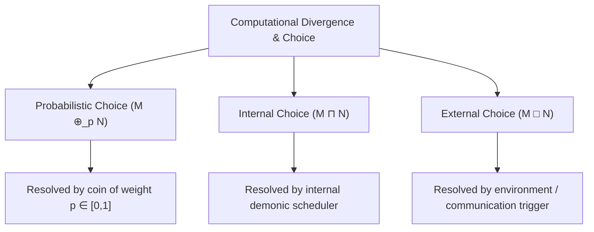
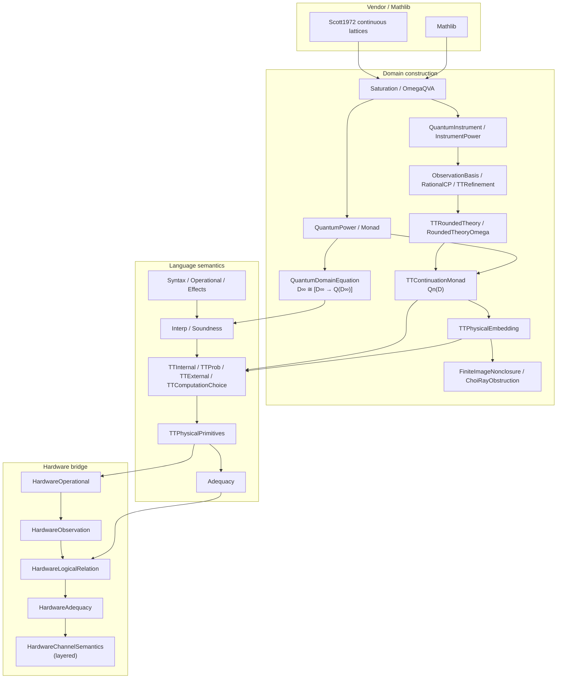
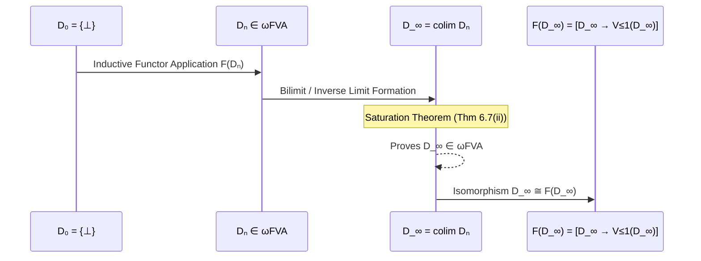
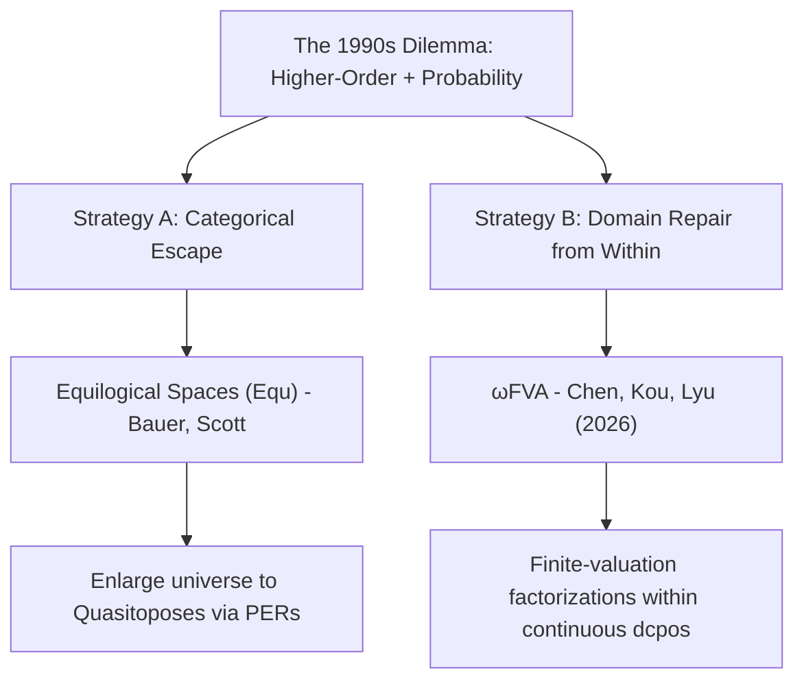
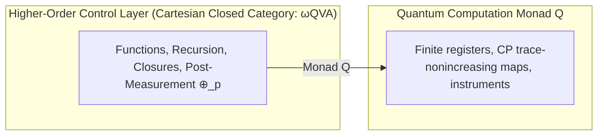
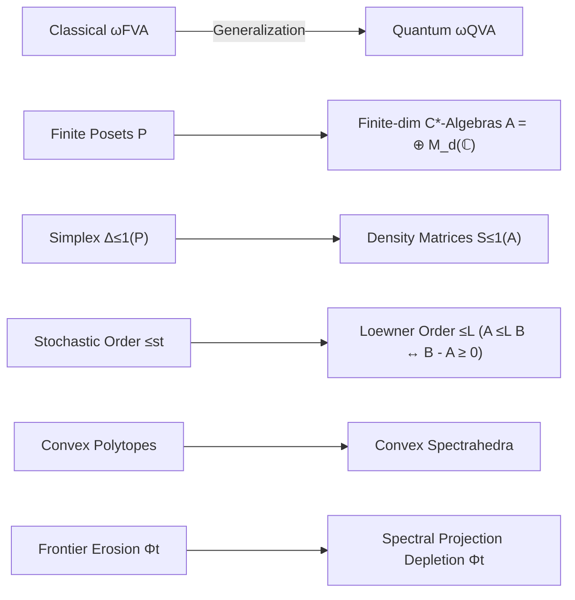

# Finite-Valuation Approximable Structures, Quantum $\lambda$-Calculus, and the Jung–Tix Problem: Semantics and Formal Verification in Lean 4


---

## Abstract

This note records a Lean 4 formalization of untyped call-by-value $\lambda$-calculus
with probabilistic ($\oplus_p$), internal ($\sqcap$), and external ($\Box$) choice
and finite quantum instruments. Values live in $D_\infty$; terms denote computations
in a quantum-effect monad $Q(D_\infty)$ with call-by-value reflexivity
$D_\infty\cong[D_\infty\to Q(D_\infty)]$, not pure $D\cong[D\to D]$ or
$Q\cong[Q\to Q]$. We mechanize $\omega\mathbf{QVA}$ (quantum-valuation approximable
domains), a parameterized inverse-limit solution for every `QuantumPowerModel`, and
the fixed-register continuation instance $\mathcal Q_n(D)=[[D\to R_n]\to R_n]$.
Finite CP instruments embed with exact unit, presented map/bind agreement, TT
refinement recovery, and a no-finite-image-Scott-retract obstruction. A qubit CEK
machine and channel-tree semantics yield presented completeness and token adequacy
for the explicit `ClosedStuckFreeCoverage` fragment (not all closed terms). The
revised circuit layer defines a versioned Composer/OpenQASM AST, an ideal
classical--quantum instrument denotation, a total Composer-to-`emit`
embedding, and a source compiler whose denotation-preservation theorem is
stated after `hideScratch` initializes and discards reserved `q+1,c+1`
scratch resources, with no caller-supplied lowering law. The
Palomar capstone is `canonical_omegaQVA_quantum_domain_equation_solved` in
`Challenge.lean`. Vendored Scott 1972 continuous lattices support the domain layer.
Lean was written by AI agents under the author's direction and review; proofs are
kernel-checked. Short Lean fragments appear in the narrative; full sources are indexed
at https://github.com/catskillsresearch/qlambda.

---

## Introduction and Background

The Scott–Strachey programme interprets untyped $\lambda$-calculus by solving a reflexive domain equation. Classically one solves $D\cong[D\to D]$: every value is a continuous function from values to values. That equation describes a pure, effect-free universe. Concurrent and nondeterministic computation needs more. Powerdomains (Plotkin, Smyth, Hoare) model internal nondeterminism ($\sqcap$) and external interactive choice ($\Box$). Probabilistic CSP (pCSP) and higher-order probabilistic programming quantify randomized branching by the subprobability valuation powerdomain $\mathcal{V}_{\le 1}$, leading to equations of the form
$$D \cong [D \to \mathcal{P}(\mathcal{V}_{\le 1}(D))].$$
Such equations require a category that is simultaneously Cartesian closed (for $[D\to\dots]$) and closed under $\mathcal{V}_{\le 1}$. In 1998, Jung and Tix identified a persistent obstruction: standard Cartesian closed categories of continuous domains (bifinite, RB, FS) were not known to be preserved by $\mathcal{V}_{\le 1}$. In August 2026, Chen, Kou, and Lyu resolved the Jung–Tix problem by introducing $\omega\mathbf{FVA}$ (finite-valuation approximable domains), the first full Cartesian closed subcategory of continuous domains closed under $\mathcal{V}_{\le 1}$ and $\mathcal{V}_1$.

This paper takes the next step: from classical CSP/pCSP interpretations of $\oplus_p$, $\sqcap$, and $\Box$ on ordinary process or $\lambda$-terms, to a call-by-value interpretation of those same operators as higher-order classical control over a quantum computer. The three choice effects remain distinct classical control operations. They are realized, together with finite completely positive instruments, inside a quantum-effect domain $Q(D_\infty)$. Unitary evolution and measurement are not substitutes for $\oplus_p$, $\sqcap$, or $\Box$.

Call-by-value with effects forces a **value / computation** split. A **monad** $Q$ packages that split: unit $D\to Q(D)$ wraps a value as a trivial computation, and bind $Q(D)\times(D\to Q(E))\to Q(E)$ sequences a computation with a value-to-computation continuation. Untyped call-by-value abstraction then denotes a *value* of function space type $[D\to Q(D)]$—given a value, return a computation—while every *term* denotes an element of $Q(D)$. The matching reflexive equation is therefore
$$D_\infty\cong[D_\infty\to Q(D_\infty)],$$
not $D\cong[D\to D]$ and not $Q\cong[Q\to Q]$.

The contrapositives matter. Solving only $D\cong[D\to D]$ while wanting instruments and choice leaves no place for effects. Solving $Q\cong[Q\to Q]$ would treat computations themselves as the untyped $\lambda$-universe (call-by-name / “everything is a thunk”), contradicting a Control–Environment–Kontinuation (CEK) machine that evaluates the function, evaluates the argument, and only then performs $\beta$-reduction, and contradicting how CP instruments act on values rather than on open computations. The claim of this development is the middle path: untyped call-by-value $\lambda$-calculus with choice and a quantum-effect monad $Q$, values solving $D_\infty\cong[D_\infty\to Q(D_\infty)]$, and terms denoting elements of $Q(D_\infty)$.

The formalized contribution lifts the finite-separation and saturation pattern from classical valuations to quantum spectrahedra ($\omega\mathbf{QVA}$), solves the parameterized equation above for a continuation power $Q=\mathcal Q_n$, and connects the denotation to a qubit CEK machine and channel-tree adequacy fragment. Chen–Kou–Lyu’s classical $\omega\mathbf{FVA}$ theorem and the Jung–Tix history are motivating literature, not a full Lean target of this repository. The revised circuit layer verifies a frozen IBM Composer/OpenQASM target through shared ideal CQ semantics; it is not a theorem about the Python Qiskit API or noisy backend behavior. The later sections state the exact Lean boundary.

Several established approaches also combine domain structure, higher-order
quantum computation, and recursion. Kashefi's quantum domain theory orders
quantum states and operators to study computability. Pagani, Selinger, and
Valiron give quantitative semantics for higher-order quantum programs.
Kornell, Lindenhovius, and Mislove's qCPO model supports term and recursive
types for LNL-FPC and Proto-Quipper-M, while Tsukada and Asada's enriched
presheaf model is fully abstract for Quantum FPC with arbitrary recursive
types. Those works provide richer linear typing, categorical, adequacy, or
full-abstraction results than are claimed here. The distinct contribution
formalized here is a Lean-checked, parameterized Scott inverse-limit equation
inside the spectrahedral finite-separation class $\omega\mathbf{QVA}$,
together with the specific fixed-register continuation instance and the
separately bounded channel-tree adequacy results. No equivalence with qCPO,
Quantum FPC, or Kashefi's quantum domains is claimed.

---

## The Three Semantic Objects: $\omega\mathbf{QVA}$, $D_\infty$, and $Q$

The domain equation uses three objects that must be distinguished before the
language and circuit layers are introduced.

### The category $\omega\mathbf{QVA}$

An object of $\omega\mathbf{QVA}$ is a complete lattice $D$ carrying an
`IsOmegaQVA D` witness. Concretely, $D$ is a continuous lattice and there is a
monotone sequence of Scott-continuous endomaps $a_n:D\to D$ such that
$\bigsqcup_n a_n=\mathrm{id}_D$. Every $a_n$ is finitely separated and
factors through a finite product
$$
\prod_k \mathcal S_{\leq 1}(M_{d_k}),
$$
where $\mathcal S_{\leq 1}(M_d)$ is the Loewner-ordered spectrahedron of
sub-normalized $d$-dimensional density matrices. Morphisms are
Scott-continuous maps. Thus $\omega\mathbf{QVA}$ is the full subcategory of
continuous lattices selected by this approximation property; it is not an
undefined ambient category. Lean records the factors as `DensityVec`, the
factorization as `QFactorable`, and the object property as `IsOmegaQVA` in
`QLambda/OmegaQVA.lean`.

### The value object $D_\infty$

Fix a quantum power model $Q$, a pointed object $D_0\in\omega\mathbf{QVA}$,
and a projection pair
$$
j_0:D_0\mathrel{\triangleleft}[D_0\to Q(D_0)].
$$
Form the tower $D_{n+1}=[D_n\to Q(D_n)]$. The object $D_\infty$ is the
inverse limit `QDInf M D₀ j₀` of this tower: its elements are compatible
tuples of finite-stage approximations. The constructed Scott maps
`qEmbInfInf` and `qProjInfInf` are mutual inverses and give
$$
D_\infty\cong[D_\infty\to Q(D_\infty)].
$$
The canonical theorem takes $D_0$ to be the one-point lattice `PUnit` and
constructs $j_0$ automatically. The tower and limit live in
`QLambda/QDomain.lean` and `QLambda/QuantumDomainEquation.lean`.

### The computation functor and monad $Q$

The parameter $Q$ is not the value object and is not a circuit graph.
`IsQuantumPowerModel Q` requires that $Q(D)$ be a complete lattice, that $Q$
act functorially and order-enrichedly on Scott maps, that it preserve
suprema of monotone countable families of maps, and that it preserve
$\omega\mathbf{QVA}$. `IsQuantumMonad Q` additionally supplies
Scott-continuous unit and bind satisfying the monad laws. Values inhabit
$D_\infty$; computations inhabit $Q(D_\infty)$; call-by-value functions
inhabit $[D_\infty\to Q(D_\infty)]$ before being folded through the displayed
isomorphism.

The concrete fixed-register instance used by the interpreter is
$$
\mathcal Q_n(D)=[[D\to R_n]\to R_n],
$$
where $R_n$ is the rounded TT result domain. In Lean this is
`TTContinuationPower n D`, with power-model and monad instances in
`QLambda/TTContinuationMonad.lean`. Finite Kraus instruments are physical
presentations embedded into this continuation model; they are not themselves
identified with $D_\infty$.

### Symbol-to-Lean crosswalk

| Paper object | Lean declaration | Primary module |
| :--- | :--- | :--- |
| $\omega\mathbf{QVA}$ object | `IsOmegaQVA`, `QFactorable`, `DensityVec` | `QLambda/OmegaQVA.lean` |
| $\mathcal S_{\leq1}(M_d)$ | `SubNormalizedDensity d` | `QLambda/QuantumStateSpace.lean` |
| abstract quantum power $Q$ | `IsQuantumPowerModel`, `QuantumPowerModel` | `QLambda/QuantumPower.lean` |
| monad structure on $Q$ | `IsQuantumMonad` | `QLambda/Monad.lean` |
| tower and $D_\infty$ | `qTower`, `QDInf` | `QLambda/QDomain.lean` |
| limit isomorphism | `qEmbInfInf`, `qProjInfInf` | `QLambda/QuantumDomainEquation.lean` |
| canonical capstone | `canonical_omegaQVA_quantum_domain_equation_solved` | proof: `QLambda/QuantumDomainEquation.lean`; Palomar statement: `Challenge.lean` |
| semantic values/computations | `SemanticValue`, `SemanticComp` | `QLambda/Interp.lean` |
| concrete $\mathcal Q_n$ | `TTContinuationPower`, `TTContinuation.model` | `QLambda/TTContinuationMonad.lean` |

The classical $\omega\mathbf{FVA}$ construction discussed later is motivating
literature with valuation power $\mathcal V_{\leq1}$; its $D_\infty$ should
not be confused with the quantum tower `QDInf` defined here.

---

## Source Language: Call-by-Value $q\lambda$ with `emit`

The revised source language keeps the untyped call-by-value
$\lambda$-calculus small. Composer instructions are data at one explicit
quantum boundary rather than one new $\lambda$ constructor per gate:

$$
M,N ::= x\mid\lambda x.M\mid M\,N\mid()
      \mid\operatorname{emit} I\mid M;N
      \mid M\oplus_p N\mid M\sqcap_k N\mid M\mathbin{\Box_e}N.
$$

Here $I$ belongs to the versioned Composer instruction AST, $k$ names a
compile-time scheduler decision, and $e$ is an expression over the fixed
classical register. Qubit occurrences in $I$ are opaque `Fin q` handles;
copying a handle aliases a circuit wire and never copies its quantum state.
The context-free grammar is separated from `Command.WellFormed`, which checks
the gate manifest, arities, distinct operands, register scope, and structured
control.

Untyped terms do not all terminate. The staging relation `Source.Elaborates`
therefore records when a closed CBV term produces the finite residual
$$
C ::= \operatorname{skip}\mid\operatorname{emit}I\mid C;C
  \mid C\oplus_p C\mid C\sqcap_k C\mid C\mathbin{\Box_e}C,
$$
which is the exact input type of the total Composer compiler.



**Figure.** The three classical choice operators and how each is resolved: probabilistic $\oplus_p$, internal $\sqcap$, and external $\Box$.

### The Three Choice Operators
1. **Probabilistic Choice ($M \oplus_p N$):**
   * **Behavior:** A coin weighted by $p \in [0, 1]$ is flipped at reduction time; the term reduces to $M$ with probability $p$ and to $N$ with probability $1 - p$.
   * **Found in:** Probabilistic $\lambda$-calculus, Probabilistic PCF (Plotkin 1989, Jones 1990, Dal Lago, Ehrhard et al.).
2. **Internal Nondeterministic Choice ($M \sqcap N$ or $M \oplus N$):**
   * **Behavior:** Unpredictable, unobservable scheduling or arbitrary choice between two functions/expressions.
   * **Found in:** De’Liguoro–Piperno’s non-deterministic $\lambda$-calculus, Boudol’s concurrent $\lambda$-calculus.
3. **External / Interactive Choice ($M \mathbin{\Box} N$ or Guarded Selection):**
   * **Behavior:** Waiting for the environment (e.g., awaiting a message on a communication channel or waiting for an argument/input event).
   * **Canonical functional equivalent:** The `select` construct in Concurrent ML (CML) or guarded alternative evaluation:
     $$\text{sync}(\text{receive}(c_1) \Rightarrow \lambda x. M \;\mathbin{\Box}\; \text{receive}(c_2) \Rightarrow \lambda y. N)$$

Classically, giving this calculus a denotational semantics (without quantum effects) means solving something like
$$D \cong [D \to \mathcal{P}(\mathcal{V}_{\le 1}(D))],$$
where $[D \to \dots]$ models higher-order functions, $\mathcal{P}$ models internal choice ($\sqcap$), and $\mathcal{V}_{\le 1}$ models probabilistic choice ($\oplus_p$). In this paper the ambient category is quantum ($\omega\mathbf{QVA}$), application is call-by-value, and effects live in a monad $Q$. The equation we solve is therefore the call-by-value form $D_\infty\cong[D_\infty\to Q(D_\infty)]$ of the previous section, with $\oplus_p$, $\sqcap$, and $\Box$ interpreted as operations on $Q(D_\infty)$ alongside finite CP instruments—not by collapsing them into a pure domain equation $D\cong[D\to D]$ or into $Q\cong[Q\to Q]$.

---

## Verified Composer Target and Circuit Denotation

The target is one versioned IBM Quantum Composer / OpenQASM 3 circuit, not
the Python Qiskit API. `Composer.Program v q c` contains fixed finite quantum
and classical registers and a recursive instruction AST for generic gates,
measurement, reset, store, barrier, delay, `if`, `switch`, bounded `for` and
`while`, boxes, and structured `break`/`continue`. `Fin` indices enforce
register bounds. `Program.toOpenQASM` is an export presentation; it does not
define circuit meaning.

### The semantic product

For $q$ qubits and $c$ classical bits define
$$
\mathcal D_{\mathrm{CQ}}(q,c)
 =(\operatorname{Fin}(c)\to\mathbf2)
   \longrightarrow
   \operatorname{FiniteInstrumentComp}
     (2^q,\operatorname{Fin}(c)\to\mathbf2).
$$
Thus a circuit consumes a classical store and denotes a finite CP instrument
whose classical outcomes are final stores. Gates are interpreted by unitary
or more general trace-nonincreasing operations supplied by
`Composer.Model`; measurement is an instrument updating a classical bit;
reset is a quantum operation; sequencing is instrument bind; bounded control
is interpreted structurally. Barrier and delay are identities in the ideal
semantics while remaining present in syntax.

Circuit denotations are compared by `CQ.Eq`: for every initial store and
every Kraus-valued postcondition, their weakest-precondition Kraus families
represent the same CP map. This avoids equating accidental Kraus-list or
existential outcome presentations.

### Two translations

`Compiler.compile` maps a finite residual to one Composer block:

| Source residual | Composer target | Resolution |
| :--- | :--- | :--- |
| `emit I` | instruction `I` | shared denotation definitionally |
| `A ; B` | block concatenation | instrument bind |
| $A\sqcap_k B$ | one selected branch | supplied scheduler at key $k$ |
| $A\mathbin{\Box_e}B$ | Composer `if (e)` | external classical store |
| $A\oplus_p B$ | `physicalCoin`: reset, RY, measure, conditional on the reserved last wire/bit | `hideScratch` after `canonicalModel` |

The last row is physical, not a caller-supplied law. `physicalCoin` always
uses the reserved final qubit and bit. Coin-angle amplitudes are
`ry₂_coin_zero`; reset then RY on the reserved wire is
`physicalCoin_amplitudes`. There is no `LawfulProbLowering`.

In the other direction, `Compiler.embed` maps every Composer block totally
to a right-associated sequence of `emit` commands. It does not guess
high-level choices from gate patterns.

### Machine-checked preservation

The intended compiler theorem is
$$
\operatorname{hideScratch}(\llbracket\operatorname{compile}(C)\rrbracket)
\;\simeq_{\mathrm{CQ}}\;
\llbracket C\rrbracket_{q\lambda}
$$
on reserved $q+1,c+1$ resources. `compile_correct` discharges this on the
`Compilable` fragment: skip, data-wire `X`/`H`/`RY`/`CX`, measurement,
reset, store, general sequencing, probabilistic choice, intern, and
extern. `hideScratch_coin_op` is the weighted-choice case: reset, coin-angle
RY, scratch measurement, branch dispatch, and scratch erasure denote
source `probSem`. `elaborates_compile_correct` composes CBV staging with
that theorem. `denote_embed` extends the same equality to recompilation of
a logical block built from the supported instructions. `compile_embed`
proves `compile (embed K) = liftBlock K`.
`hideScratch_seq_of_insensitive` is the hidden sequencing law. These
theorems are in `QLambda/Compiler/Correctness.lean`. They concern the
frozen ideal `canonicalModel`, not backend transpilation, calibration,
noise, or arbitrary Python programs.

---

## Claimed domain equation, Lean dependency map, and status

### Claimed and implemented domain equation

The equation claimed, parameterized, and mechanized is the call-by-value quantum-effect equation of the introduction:

$$
\boxed{\;D_\infty\;\in\;\omega\mathbf{QVA}
\qquad\text{and}\qquad
D_\infty\;\cong\;[D_\infty\to Q(D_\infty)].\;}
$$

#### What $Q$ is

$Q$ is the quantum computation / effect layer on values—not the value domain itself.

| Role | Object | Meaning |
| :--- | :--- | :--- |
| Values | $D_\infty$ | Closures, payloads, what gets substituted |
| Computations | $Q(D_\infty)$ | What a term denotes (effects, choice, instruments) |
| Function space | $[D_\infty\to Q(D_\infty)]$ | A value that, given a value, returns a computation |

A monad on values is specified by unit $D\to Q(D)$ (trivial computation) and bind $Q(D)\times(D\to Q(E))\to Q(E)$ (sequence). Abstractly, $Q$ is any locally continuous, $\omega\mathbf{QVA}$-closed endofunctor of complete lattices equipped with that monadic structure (Lean: `IsQuantumPowerModel` / `IsQuantumMonad`).

**Concrete instance.** The fixed-register continuation power
$$
Q(D)\;=\;\mathcal Q_n(D)\;=\;[[D\to R_n]\to R_n],
$$
where $R_n$ is the continuous lattice of finitary observation results for an $n$-dimensional register (Lean: `TTResult n` / `TTContinuation.model n`). Qubit hardware takes $n=2$. Lean’s Palomar theorem of record is `canonical_omegaQVA_quantum_domain_equation_solved` in `QLambda/QuantumDomainEquation.lean`; it constructs the one-point initial domain and bonding pair for every quantum power model. The more general `omegaQVA_quantum_domain_equation_solved` retains arbitrary supplied initial data. In this presentation $Q$ packages finite quantum instruments together with classical control effects as Scott-continuous maps on result continuations.

#### Contrapositives (what is not claimed)

* **Not** $D\cong[D\to D]$. That is the pure Scott equation; it has no computation monad and no place for instruments or choice as effects.
* **Not** $Q\cong[Q\to Q]$. That would make computations the untyped $\lambda$-universe (call-by-name / thunks), erase the unit/bind layer, and fight both CEK call-by-value evaluation and the fact that CP instruments act on values. Kleisli arrows for $Q$ are maps $[D\to Q(D)]$, not $[Q(D)\to Q(D)]$.
* Abstractions denote elements of $D_\infty$ (lifted by unit into $Q(D_\infty)$); applications denote elements of $Q(D_\infty)$ directly.

### Main Lean module dependencies



**Figure.** Dependency map of the main Lean modules, from vendored Scott lattices through the domain equation, language semantics, and hardware channel-tree layer.

### Hardware channel submodule dependencies

`QLambda/HardwareChannelSemantics.lean` is a barrel re-export. The proof DAG is linear:

```mermaid
flowchart LR
  Config["Config<br/>trees, relations,<br/>base completeness"]
  Identity["Identity<br/>unique-successor<br/>step transfers"]
  Spines["Spines<br/>NoApp / AdminNoApp<br/>FunAppFrag / Produces<br/>FunFrame stacks"]
  UnderFrame["UnderFrame<br/>under-frame lemmas<br/>closed specials"]
  FunApp["FunApp<br/>fragment inductions<br/>under residual frames"]
  Closed["Closed<br/>closed Produces /<br/>FunAppFrag + tokens"]
  Fundamental["Fundamental<br/>PathChannelEvaluation<br/>closed-term bridge"]
  Productive["Productive<br/>ProductiveClosedCase<br/>restricted extern arguments"]
  Coverage["Coverage<br/>ClosedStuckFreeCoverage<br/>final capstones"]

  Config --> Identity --> Spines --> UnderFrame --> FunApp --> Closed --> Fundamental --> Productive --> Coverage
```



**Figure.** Linear proof DAG of the `HardwareChannelSemantics` submodules, from `Config` through `Coverage`.

Upstream of `Config`: `HardwareAdequacy` (which rests on `HardwareLogicalRelation`, `HardwareObservation`, `HardwareOperational`, and the TT/adequacy stack above).

Proved claims and exact boundaries are collected in *Claims formalized in
Lean 4* below and indexed compactly in `THEOREMS.md`.

---

## Classical Motivation: Recursive Domain Equations in $\omega\mathbf{FVA}$

This section summarizes the Chen–Kou–Lyu construction used as motivation.
The classical $\omega\mathbf{FVA}$ development and its Jung–Tix theorem are
not formalized here in full. The Lean contribution begins from independently
mechanized finite-separation and saturation ingredients and proves the
quantum $\omega\mathbf{QVA}$ results stated later.

The category $\omega\mathbf{FVA}$ consists of continuous domains $D$ whose identity map is the directed supremum of an increasing sequence of maps factoring through subprobability valuation spaces over finite posets $P_n$:
$$D \xrightarrow{\;p_n\;} \mathcal{V}_{\le 1}(P_n) \xrightarrow{\;e_n\;} D, \qquad \sup_{n \in \mathbb{N}} (e_n \circ p_n) = \mathrm{id}_D$$

The Smyth–Plotkin embedding-projection ($e$-$p$) method proceeds in five steps:



**Figure.** Smyth--Plotkin embedding-projection construction of the bilimit $D_\infty$ in $\omega\mathbf{FVA}$.

### Step 1: Establish the Ambient Cartesian Closed Category ($\omega\mathbf{FVA}$)
By Theorem 10.4 of Chen–Kou–Lyu (2026):
* **Initial / Pointed Object:** $\bot \in D$ exists for all $D \in \omega\mathbf{FVA}$, and the terminal domain $\mathbb{I} = \{\bot\} = \mathcal{V}_{\le 1}(\emptyset)$ is in $\omega\mathbf{FVA}$.
* **Cartesian Closure:** If $X, Y \in \omega\mathbf{FVA}$, then $[X \to Y] \in \omega\mathbf{FVA}$.
* **Probabilistic Closure:** If $X \in \omega\mathbf{FVA}$, then $\mathcal{V}_{\le 1}(X) \in \omega\mathbf{FVA}$ and $\mathcal{V}_1(X) \in \omega\mathbf{FVA}$.

Therefore, the mixed-variance endofunctor $F(X) = [X \to \mathcal{V}_{\le 1}(X)]$ is well-defined internally on $\omega\mathbf{FVA}$.

### Step 2: Build the Approximation Chain via Embedding-Projection Pairs
An embedding-projection pair $(e, p)$ satisfies $p \circ e = \mathrm{id}_X$ and $e \circ p \le \mathrm{id}_Y$.
* **Base stage:** $D_0 = \{\bot\}$.
* **Inductive stages:** $D_{n+1} = F(D_n) = [D_n \to \mathcal{V}_{\le 1}(D_n)] \in \omega\mathbf{FVA}$.
* **Lifting:** 
  $$e_{n+1} = F(e_n, p_n) = [p_n \to \mathcal{V}_{\le 1}(e_n)] : D_{n+1} \to D_{n+2}$$
  $$p_{n+1} = F(p_n, e_n) = [e_n \to \mathcal{V}_{\le 1}(p_n)] : D_{n+2} \to D_{n+1}$$
  yielding the expanding chain: $D_0 \rightleftarrows D_1 \rightleftarrows D_2 \rightleftarrows \dots \rightleftarrows D_n \rightleftarrows \dots$

### Step 3: Take the Bilimit / Colimit $D_\infty$
In $\mathbf{DCPO}$, the bilimit is the standard inverse limit:
$$D_\infty = \left\{ (x_n)_{n \in \mathbb{N}} \in \prod_{n \in \mathbb{N}} D_n \;\middle|\; \forall n, \, x_n = p_n(x_{n+1}) \right\}$$
equipped with canonical limiting pairs $(e_n^\infty : D_n \to D_\infty, \, p_n^\infty : D_\infty \to D_n)$ satisfying $p_n^\infty \circ e_n^\infty = \mathrm{id}_{D_n}$, $e_n^\infty \circ p_n^\infty \le e_{n+1}^\infty \circ p_{n+1}^\infty \le \mathrm{id}_{D_\infty}$, and $\sup_{n \in \mathbb{N}} (e_n^\infty \circ p_n^\infty) = \mathrm{id}_{D_\infty}$.

### Step 4: Proving $D_\infty \in \omega\mathbf{FVA}$ (The Saturation Theorem)
By Theorem 6.7(ii) (Unified Kernel-Lifting / Saturation Theorem):
> If $D$ is a domain with an increasing sequence $a_n = e_n p_n \le \mathrm{id}_D$ such that $\sup_n a_n = \mathrm{id}_D$ factoring through $B_n \in \omega\mathbf{FVA}$, then **$D \in \omega\mathbf{FVA}$**.

Setting $B_n = D_n \in \omega\mathbf{FVA}$ and $a_n = e_n^\infty \circ p_n^\infty$, Theorem 6.7(ii) guarantees **$D_\infty \in \omega\mathbf{FVA}$**.

### Step 5: Establish the Isomorphism $D_\infty \cong [D_\infty \to \mathcal{V}_{\le 1}(D_\infty)]$
Because $F$ preserves directed suprema of embedding-projection pairs:
$$F(D_\infty) = F\left(\operatorname{colim}_n D_n\right) \cong \operatorname{colim}_n F(D_n) = \operatorname{colim}_n D_{n+1} \cong D_\infty$$
Thus, $D_\infty \cong [D_\infty \to \mathcal{V}_{\le 1}(D_\infty)]$ in $\omega\mathbf{FVA}$.

---

## Comparison: $\omega\mathbf{FVA}$ vs. Equilogical Spaces ($\mathbf{Equ}$)

In the late 1990s, semanticists recognized that continuous domains ($\mathbf{CONT}$) failed Cartesian closure and that standard CCC subclasses were not closed under probabilistic valuations. This led to two historical pathways:



**Figure.** Two historical strategies for combining higher-order functions with probability: equilogical spaces versus $\omega\mathbf{FVA}$.

1. **Strategy A — Equilogical Spaces ($\mathbf{Equ}$):** Formed by pairs $(X, \sim)$ of $T_0$ spaces with equivalence relations. $\mathbf{Equ}$ is a quasitopos (locally Cartesian closed, handles quotients and sheaves). The trade-off is losing concrete order-theoretic approximations and working with realizers.
2. **Strategy B — $\omega\mathbf{FVA}$:** Retains pure continuous dcpos with Scott topologies and the way-below relation ($\ll$). It resolves the obstruction by replacing finite-image deflations with finite-valuation factorizations ($D \to \mathcal{V}_{\le 1}(P_n) \to D$).
3. **Categorical Embedding:** Every countably based domain in $\omega\mathbf{FVA}$ embeds fully and faithfully into $\mathbf{Equ}$ as $(D, =_D)$:
   $$\omega\mathbf{FVA} \hookrightarrow \omega\mathbf{FS}_\bot \hookrightarrow \mathbf{Equ}$$

### Comparison Table

| Feature | Equilogical Spaces ($\mathbf{Equ}$) | Finite-Valuation Domains ($\omega\mathbf{FVA}$) |
| :--- | :--- | :--- |
| **Mathematical Nature** | Topological spaces + Equivalence relations (Quasitopos) | Partially ordered sets (Continuous DCPOs / FS-domains) |
| **Cartesian Closed?** | **Yes** (by categorical design) | **Yes** (Theorem 10.4) |
| **Probabilistic Monads?** | **Yes** (via realizability/sheaves) | **Yes** ($\mathcal{V}_{\le 1}, \mathcal{V}_1$ are internal functors) |
| **Approximation Theory** | Realizers / Moduli of continuity | Way-below relation ($\ll$) & finite posets $P_n$ |
| **Philosophical Role** | Higher-order probability in topological/categorical logic | Higher-order probability in classical domain theory |

---

## The Quantum Extension: From Classical Probability to $\omega\mathbf{QVA}$

In quantum mechanics, unitary evolution creates coherent superposition, while measurement turns that coherence into a classical distribution of outcomes. For a computational-basis measurement,

$$\alpha\vert 0 \rangle + \beta\vert 1 \rangle
  \xrightarrow{\{\rho\mapsto P_i\rho P_i\}_{i=0,1}}
  \begin{cases}
    0 & \text{with probability } |\alpha|^2,\\
    1 & \text{with probability } |\beta|^2.
  \end{cases}$$

The superposition before measurement is not the probabilistic term $M\oplus_p N$: the latter denotes classical randomized control. Internal scheduler choice $M\sqcap N$ and external guarded choice $M\mathbin{\Box}N$ are two further, independent effects. They do not occur as successive stages after measurement.

### The No-Cloning Barrier and the LNL Architecture
Because the **No-Cloning Theorem** ($|\psi\rangle \not\to |\psi\rangle \otimes |\psi\rangle$) forbids diagonal copy maps $\Delta = \langle \mathrm{id}, \mathrm{id} \rangle$, pure quantum states cannot live directly in a Cartesian Closed Category. Instead, following Selinger and Valiron (2006/2009), we employ a **Linear-Nonlinear (LNL) / Monadic architecture**:



**Figure.** Linear-nonlinear architecture: higher-order classical control in $\omega\mathbf{QVA}$ and the quantum computation monad $Q$.

### Generalizing to $\omega\mathbf{QVA}$
We generalize the Chen–Kou–Lyu construction from commutative probability simplices to non-commutative density operator spaces:



**Figure.** Generalization of Chen--Kou--Lyu $\omega\mathbf{FVA}$ ingredients to spectrahedral $\omega\mathbf{QVA}$.

1. **Finite State Spaces:** Let $A = \bigoplus_{k=1}^m M_{d_k}(\mathbb{C})$. Its sub-normalized density operator space is $\mathcal{S}_{\le 1}(A) = \{ \rho \in A^*_+ \mid \operatorname{Tr}(\rho) \le 1 \}$ equipped with the Loewner partial order $\rho \le_L \sigma \iff \sigma - \rho \ge 0$.
2. **Spectral Depletion Semigroup:** For $\rho = \sum \lambda_i E_i$, $\Phi_t(\rho)$ scales down maximal eigenspace projections, preserving the Loewner order ($\rho \le_L \sigma \implies \Phi_t(\rho) \le_L \Phi_t(\sigma)$) and establishing that $\mathcal{S}_{\le 1}(A)$ is an FS-domain.
3. **Definition ($\omega\mathbf{QVA}$):** A domain $D$ is in $\omega\mathbf{QVA}$ if $\mathrm{id}_D = \sup_n a_n$ where each $a_n$ factors through $\mathcal{S}_{\le 1}(A_n)$ for finite-dimensional $C^*$-algebras $A_n$.
4. **Saturation:** The 2-level flattening lemma (Lemma 6.6) depends only on way-below interpolation ($\ll$) and finite separation, so the bilimit $D_\infty = \operatorname{colim}_n D_n$ lies in $\omega\mathbf{QVA}$. The isomorphism $D_\infty \cong [D_\infty \to \mathcal{Q}(D_\infty)]$ additionally requires a locally continuous endofunctor $\mathcal{Q}$ on $\omega\mathbf{QVA}$.

### The surviving roadmap

The development separates the construction of the semantic domain from the semantics of a language. The broad roadmap that survived formal proof is:

1. **Ambient domain theory — complete.** Define $\omega\mathbf{QVA}$, prove Cartesian closure, prove closure of countable rounded theories, and solve the parameterized inverse-limit equation.
2. **Concrete quantum effect — complete for a fixed register.** Construct the continuation power
   $$\mathcal Q_n(D)=[[D\to R_n]\to R_n]$$
   and prove the functor, local-continuity, $\omega\mathbf{QVA}$-closure, and monad laws required by `IsQuantumPowerModel` and `IsQuantumMonad`.
3. **Finite physical fragment — complete with explicit boundaries.** Embed finite TNI CP instruments into $\mathcal Q_n(D)$; prove exact return and finitely presented map/bind compatibility; prove the represented-test direction of refinement correspondence; and replace the unsupported finite-retract claim by a directed-supremum obstruction theorem.
4. **Language semantics — hardware bridge and covered stuck-free capstone proved.** Terms with closed quantum primitives and recursive abstractions have a compositional Scott-continuous interpretation in $Q(D_\infty)$. A concrete qubit CEK machine carries normalized density states and classical closures and keeps internal, weighted, and external transitions distinct. A separate proof-only subnormalized channel-tree semantics retains all CP branches, including zero-mass branches, and folds them into physical instruments. Runtime logical relations, positive-run correspondence, recursive finite approximants, and token adequacy for each realized channel tree are proved. `ChannelTreeCompleteness` is proved for closed return, Pauli-X, measure-Z, compositional internal and external choice, and probabilistic endpoints; interior probability is complete at presented continuations by physical coin aggregation. Unique-successor identity CEK steps transfer completeness, and recursive denotations are Scott suprema of finite unfoldings. Presented channel-tree completeness and token adequacy are proved for the stacked-application fragments `Produces 0` / `FunAppFrag`, for `ProductiveClosedCase`, and finally for every term carrying `ClosedStuckFreeCoverage`. `RestrictedExternApplication` covers `app (lam …) (extern left right)` and its recursive-lambda analogue under explicit `NoApp`, `AdminNoApp`, and `Atomic` hypotheses. This consolidated boundary is sufficient, not an assertion for every closed term. The rank-one Choi-ray obstruction for `PhysicalBasisApproximant` is formalized for register dimension at least two.

The word “complete” in items 1–3 refers to the stated Lean interfaces and theorems, not to a complete quantum programming language.

### Mini-roadmaps followed during domain construction

#### From finite CP maps to a countable result domain

The first route through Scott-open indicator observations failed to characterize weakest-precondition refinement. `QLambda/RefinementCounterexample.lean` exhibits a rational qubit counterexample over the four-element Boolean diamond: every cumulative Scott-open Choi observation refines, but a monotone Kraus-valued postcondition separates the instruments.

The replacement roadmap was:

1. restrict rational step-postcondition codes to trace-nonincreasing CP maps;
2. test weakest-precondition Choi matrices by finite conjunctions of strict Gaussian-rational quadratic inequalities;
3. identify finitary TT refinement with preservation of all such atoms and tokens;
4. saturate tokens under semantic entailment and strict strengthening;
5. prove the resulting rounded theory is a continuous lattice and an $\omega\mathbf{QVA}$.

Strict inequalities are essential: they provide rational interpolation and allow a finite observation at a directed supremum to be witnessed at a finite stage.

#### From exact pullback to rational local approximation

Exact pullback of a rational Choi test through an arbitrary Kraus family need not remain rational. The successful route therefore used local approximation rather than exact syntactic closure:

1. normalize a `PUnit`-valued finite computation to its total TNI Kraus map;
2. prove uniform bounds for pulled-back Choi functionals on the compact TNI region;
3. approximate each strict functional test by a finite rational quadratic neighbourhood;
4. lift atomwise approximation to finite tokens;
5. use token derivations to extend finite physical operations Scott-continuously to all rounded result theories.

This is implemented in `TTResultAlgebra`, `TTResultApproximation`, and
`TTResultOperations` (under `QLambda/`).

#### From a failed compactness shortcut to token-local aggregation

An attempted shortcut treated an entire finitely satisfied result theory as compact. That statement is false in general: a finite instrument can satisfy infinitely many increasingly precise rational observations. The corrected proof works one output token at a time. A bind observation yields finitely many branch-local source tokens; directedness supplies one common continuation stage because the instrument has finitely many outcomes. `AggregateDerives`, `aggregateResult`, `aggregateResult_sSup`, and `bindResultScott` then give the required Scott-continuous aggregation without whole-theory compactness.

#### From an intended order equivalence and retract to the valid boundary

The continuation carrier contains arbitrary Scott-continuous higher-order maps, while the embedding only produces finite-instrument aggregators. Consequently, neither a global order equivalence nor a finite-image retract follows merely from operational agreement on finite presentations.

The proved boundary is explicit:

1. every source rational TT test is represented by a Scott result postcondition and a finite result continuation;
2. consequently, embedding order unconditionally implies `FinitaryTTRefines` for every output code;
3. any Scott projection fixing and landing in the finite image forces that image to be closed under every nonempty directed supremum;
4. therefore any concrete directed family of finite embeddings with a non-finite supremum rules out such a retraction.

The development constructs both the rational coded-test representation and a concrete one-dimensional dyadic-prefix chain of finite embeddings. The chain is directed, while its supremum is separated from every finite embedding by rational coordinate tests. Thus the finite physical image is not closed under directed suprema and admits no Scott-continuous retraction.

### Definitions produced by the construction

- `RatTNICPMatrix n` is a Gaussian-rational Choi matrix with positivity and trace-nonincreasing certificates.
- `FiniteInstrumentComp n D` is a finite family of TNI CP branches returning values in `D`.
- `FinitaryTTRefines C` (for instruments $\mu,\nu$) quantifies weakest-precondition refinement over rational finite-step postconditions.
- `TTTokenTheory n C` is the saturated rounded completion of finite strict TT tokens.
- `TTResult n` is the fixed result theory at output type `PUnit`.
- `TTContinuationPower n D` is `ScottMap (ScottMap D (TTResult n)) (TTResult n)`.
- `TTPhysicalEmbedding.embed` applied to a finite instrument $\mu$ is the Scott-continuous aggregation transformer for $\mu$.
- `CodedTestRepresentation C c` packages the Scott representation needed to recover a source test `c` from a result continuation.
- `FiniteImageScottRetraction n D` states precisely what a Scott-continuous projection onto the finite embedded image would require.
- `Term Prim` is the untyped source syntax with parameterized closed primitives and recursive function values.
- `SemanticValue Q D₀ j₀` is the solved domain $D_\infty$, while `SemanticComp Q D₀ j₀` is the single term codomain $Q(D_\infty)$.
- `interp primitive M` is a Scott map from environments to $Q(D_\infty)$; `HasComputationChoice` supplies the three still-model-dependent choice operations.
- `RestrictedExternApplication code` records the two proved lambda /
  recursive-lambda applications with an external-choice argument and their
  exact syntactic side conditions.
- `ProductiveClosedCase code` joins the path-productive cases with
  `RestrictedExternApplication`.
- `ClosedStuckFreeCoverage realize code` is the final named sufficient
  coverage boundary for closed presented channel-tree completeness.

### Principal theorems and proof ideas

**Finitary refinement.** `finitaryTTRefines_iff_atom_holds` and `finitaryTTRefines_iff_token_holds` reduce matrix refinement to strict rational quadratic separation. `satisfiedTTTheory_le_iff_finitaryTTRefines` then identifies theory inclusion with the finitary preorder. The forward direction uses Choi monotonicity; the reverse direction separates a failed Loewner inequality by a rational quadratic witness.

**Rounded completion and $\omega\mathbf{QVA}$.** `ttTokenTheory_isContinuousLattice` follows from rounded ideal completion. `RoundedTheory.isOmegaQVA` uses finite-prefix membership gates, each factoring through finite products of one-dimensional sub-normalized density spaces, to approximate the identity.

**Concrete continuation model.** `TTContinuation.model n` satisfies `IsQuantumPowerModel`; the same carrier satisfies `IsQuantumMonad`. Evaluation and precomposition are Scott-continuous, and pointwise directed suprema prove local continuity. The canonical-base theorem therefore applies without additional initial-domain data and yields
$$D_\infty\cong[D_\infty\to\mathcal Q_n(D_\infty)].$$
This specialization is named `QLambda.TTContinuation.canonical_omegaQVA_quantum_domain_equation_solved`.

**Physical embedding.** `bindResultScott_satisfied` proves that on a continuation represented by finite result instruments,
$$\operatorname{embed}(\mu)(k)
  =(\mu\mathbin{\mathrm{bind}}\nu).\operatorname{satisfiedTTTheory}.$$
The proof extracts finitely many branch-local source tokens and extends their semantic derivation to the rounded completion.

**Finite monad compatibility.** `embed_unit` is exact as an equality of Scott maps. `embed_bind_unit` and `embed_unit_bind` inherit the continuation monad unit laws. `embed_map_satisfied` and `embed_bind_satisfied` prove map and Kleisli compatibility on finitely presented result continuations, where physical finite bind has an exact meaning.

**Order boundary.** `finitaryTTRefines_test_of_embed_le` and `finitaryTTRefines_of_embed_le` recover represented rational tests from embedding order. Their proofs evaluate the pointwise Scott-map inequality at the representing continuation and use `satisfiedTTTheory_le_iff_finitaryTTRefines`.

**Retract boundary.** `finiteImage_directedSupClosed_of_retraction` applies preservation of directed suprema by the proposed Scott projection and its fixed-point law. `range_embed_dyadicStage_directed_nonclosed` supplies a concrete non-closure witness, and `no_finiteImageScottRetraction_dyadic` derives the unconditional contradiction.

**Computation-valued interpretation.** `interp_continuous` records that every term clause is Scott-continuous in its environment by construction. `interp_value` proves that ordinary and recursive abstractions are precisely the pure cases lifted through monadic unit. `recLambdaValue_unfold` is Scott’s fixed-point equation for recursive functions. `applyComp_pure_lambda` combines both monad unit laws with the $D_\infty\cong[D_\infty\to Q(D_\infty)]$ inverse equations to prove semantic β-reduction for a pure abstraction and argument.

**Covered stuck-free capstone.**
`closed_term_presented_channelTreeCompleteness_of_productive_case` handles
`ProductiveClosedCase`, including the restricted extern-as-argument forms.
`closed_stuck_free_presented_channelTreeCompleteness` then dispatches every
constructor of `ClosedStuckFreeCoverage`; only its `productiveCase` route
requires `MeasureDistinct`, while `restrictedExtern` uses the direct theorem.
`closed_stuck_free_presented_token_adequacy` composes that result with
presented channel-tree token adequacy. The theorem remains explicitly about
represented continuations and realized finite trees.

### Examples and separating cases

1. **Deterministic return.** A one-outcome identity instrument returning `d` embeds exactly as continuation evaluation at `d`: `embed (unit d) = TTContinuation.unit d`.
2. **Finite sequential composition.** When `k e` is the satisfied result theory of a finite continuation at each returned value, evaluating `embed` at $\mu$ and $k$ equals the satisfied theory of physical instrument bind. The map and bind compatibility theorems are obtained by weakest-precondition semantic equivalence.
3. **Why indicator observations are insufficient.** The Boolean-diamond qubit example proves `ObservationRefines` for $(\mu,\nu)$ while `Refines` fails. Rational CP-valued step postconditions retain the missing value-dependent quantum information.
4. **Why finite presentations are not assumed compact.** Increasing rational thresholds can approximate a boundary observation indefinitely; token-local witnesses, not a single compact satisfied theory, establish Scott continuity.
5. **One codomain for terms.** A variable does not denote a bare element of $D_\infty$ while an application denotes a computation. Both denote elements of $Q(D_\infty)$; the variable is the special case `unit` applied to $\rho(x)$. Likewise, an abstraction is folded into $D_\infty$ and then lifted by `unit`.
6. **Recursive function.** The denotation of `recLam self arg body` is the least fixed point of the Scott-continuous self-functional obtained by updating the environment first at `self`, then at `arg`, interpreting `body`, and folding the resulting function back into $D_\infty$. `recLambdaValue_unfold` proves that this value equals one unfolding of that functional.

### Abstract specification and solved domain equation

The finite spectrahedron $\mathcal{S}_{\le 1}(A)$ is an approximation factor in $\omega\mathbf{QVA}$, not the computation type $\mathcal Q(D)$. A quantum power model is instead an assignment $Q$ such that:

1. $Q(D)$ is a complete lattice whenever $D$ is;
2. $Q$ is functorial on Scott maps;
3. $Q$ is order-enriched and locally continuous on monotone $\mathbb N$-families;
4. $D\in\omega\mathbf{QVA}$ implies $Q(D)\in\omega\mathbf{QVA}$.

The general theorem accepts $D_0\in\omega\mathbf{QVA}$ together with an embedding–retraction pair whose inclusion maps $D_0\to[D_0\to Q(D_0)]$ and whose bonding retraction maps $j_0^{\mathrm{retr}}:[D_0\to Q(D_0)]\twoheadrightarrow D_0$. For the inverse limit of $D_{m+1}=[D_m\to Q(D_m)]$, `omegaQVA_quantum_domain_equation_solved` proves
$$D_\infty\in\omega\mathbf{QVA}
\qquad\text{and}\qquad
D_\infty\cong[D_\infty\to Q(D_\infty)].$$
The selected theorem `canonical_omegaQVA_quantum_domain_equation_solved` constructs this initial pair on the one-point domain for every `QuantumPowerModel`.
The mixed tower maps and inverse identities are proved from the specification and instantiate with `TTContinuation.model n`.

### Roadmap from the domain to a complete language semantics

The domain construction supplies the space in which a fixed-register untyped quantum language can be interpreted. A complete semantics still requires the following layers, in this order:

1. **Computation-valued term interpretation — complete for the stated core.** `interp` is compositional and Scott-continuous; renaming, weakening, capture-avoiding value substitution, β, and recursive β are proved.
2. **Operational semantics — hardware core complete.** The CEK machine carries a normalized qubit density matrix, closures, environments, and a continuation stack. Kraus transitions satisfy exact Born normalization and trace bounds.
3. **Probabilistic, internal, and external choice — concrete and separated.** Probability uses physical weighted aggregation, internal choice uses join, and external choice uses explicit branch tags and selectors.
4. **Adequacy — proved at the named covered stuck-free boundary.** Normalized hardware runs model executable positive outcomes; subnormalized channel trees retain every CP branch and fold into finite TNI instruments with exact TT token characterizations. A formal basis-state counterexample rules out reconstructing a state-independent channel from one arbitrary normalized run. Scott recursion is the supremum of finite unfoldings. `ChannelTreeCompleteness` is proved for closed return, Pauli-X, measure-Z, compositional internal and external choice, and probabilistic endpoints; interior probability is complete at presented continuations. Application, argument evaluation, and beta steps transfer completeness by unique-successor identity wrapping. The inductive fragments `FunAppFrag` and `Produces n` give presented completeness for nested lambda / recursive-lambda applications under matching leftover argument frames. `HardwareChannel/Fundamental.lean` assembles path transfer lemmas into `PathChannelEvaluation` / `related_pathChannelTreeTokenAdequacy`. `HardwareChannel/Productive.lean` adds `ProductiveClosedCase` and direct completeness for the restricted extern-as-argument forms. `HardwareChannel/Coverage.lean` proves the final `closed_stuck_free_presented_channelTreeCompleteness` and token theorem for `ClosedStuckFreeCoverage`. Stuck `app (ret) _` states remain excluded (`stuck_payload_under_function_no_internal_step`). A separate rank-one Choi-ray obstruction shows why finitely generated physical-basis approximants cannot interpolate every ray when the register dimension is at least two.

---

## Formal Verification in Lean 4 & Capstone Theorem

The formalization is constructed in Lean 4 on top of the `Scott1972` continuous lattice library (`https://github.com/catskillsresearch/scott1972`). Chen–Kou–Lyu-style finite-separation and saturation lemmas are mechanized in `QLambda/Saturation.lean`, and `omegaQVA_closed_under_functionSpace` proves Cartesian closure by finite-separator step-map sampling. `QLambda/QuantumInstrument.lean` develops finite Kraus instruments and proves residual CP refinement equivalent to Choi order. `QLambda/RefinementCounterexample.lean` proves indicator observations too weak for TT refinement. `QLambda/RationalCP.lean`, `QLambda/TTObservationBasis.lean`, and `QLambda/TTRefinement.lean` replace them by countable physical finitary CP-valued postconditions and prove exact satisfied-theory order correspondence. `QLambda/TTRoundedTheory.lean` forms their saturated continuous completion. `QLambda/RoundedTheoryOmega.lean` proves generically that every encodable rounded basis is an $\omega\mathbf{QVA}$ by explicit one-dimensional density factorizations. `QLambda/TTResultAlgebra.lean`, `QLambda/TTResultApproximation.lean`, and `QLambda/TTResultOperations.lean` establish TNI result normalization, rational local approximation, and Scott-continuous token-local aggregation. `QLambda/TTContinuationMonad.lean` defines $\mathcal Q_n(D)=[[D\to R_n]\to R_n]$, proves every `IsQuantumPowerModel` and `IsQuantumMonad` field, and bundles `TTContinuation.model n`. `QLambda/TTPhysicalEmbedding.lean` embeds finite physical instruments, proves finite monad compatibility on the precisely stated fragment, proves represented-test refinement recovery, and formalizes the directed-supremum obstruction to a finite-image Scott retract.

Language and hardware layers continue from that domain. `Interp.lean` and
`Soundness.lean` give computation-valued interpretation and operational
soundness. Choice algebras live in `TTInternalChoice`, `TTProbChoice`,
`TTExternalChoice`, and `TTComputationChoice`. The hardware CEK machine and
observation/logical-relation stack occupy `HardwareOperational` through
`HardwareAdequacy`. Channel-tree completeness is developed in the layered
`HardwareChannel/*` modules (`Config` through `Coverage`), re-exported by
`HardwareChannelSemantics.lean`. The compared capstone domain theorem is:

```lean
class IsQuantumPowerModel (Q : (D : Type u) → [CompleteLattice D] → Type u) where
  str : ∀ D [CompleteLattice D], CompleteLattice (Q D)
  map : ∀ {D E} [CompleteLattice D] [CompleteLattice E], ScottMap D E → ScottMap (Q D) (Q E)
  map_id : ...
  map_comp : ...
  map_mono : ...
  map_iSup : ...
  closed : ∀ {D} [CompleteLattice D], IsOmegaQVA D → IsOmegaQVA (Q D)

theorem canonical_omegaQVA_quantum_domain_equation_solved
    (M : QuantumPowerModel) :
    let D₀ := canonicalQDomain
    let j₀ := canonicalQDomainProjection M
    let Dinf := QDInf M D₀ j₀
    Nonempty (IsOmegaQVA Dinf) ∧
    ... ∧
    Nonempty (Dinf ≃o ScottMap Dinf (QuantumPower M Dinf))

structure QuantumOperation (n m : ℕ) where
  kraus : List (Matrix (Fin m) (Fin n) ℂ)
  trace_nonincreasing : ...

structure QuantumInstrument (n m outcomes : ℕ) where
  branch : Fin outcomes → List (Matrix (Fin m) (Fin n) ℂ)
  trace_nonincreasing : ...

structure FiniteInstrumentComp (n : ℕ) (D : Type*) where
  Outcome : Type
  [outcomeFintype : Fintype Outcome]
  branch : Outcome → List (Matrix (Fin n) (Fin n) ℂ)
  value : Outcome → D
  trace_nonincreasing : ...

noncomputable def TTPhysicalEmbedding.embed
    (μ : FiniteInstrumentComp n D) :
    TTContinuationPower n D :=
  TTTokenTheory.bindResultScott μ

theorem TTPhysicalEmbedding.embed_unit (d : D) :
    embed (FiniteInstrumentComp.unit (n := n) d) =
      TTContinuation.unit (n := n) d
```

### What the Lean development currently proves (checklist)

1. **Domain.** For every quantum power model $Q$, the canonical one-point tower has $D_\infty\in\omega\mathbf{QVA}$ and $D_\infty\cong[D_\infty\to Q(D_\infty)]$; this is instantiated at $\mathcal Q_n$. A separate theorem permits arbitrary supplied $D_0$ and projection pair.
2. **Physical fragment.** Exact `embed_unit`; map/bind agreement on finitely presented continuations; every rational TT test has a Scott representation; embedding order recovers `FinitaryTTRefines`; no Scott retract onto the finite embedded image.
3. **Interpretation.** Compositional Scott-continuous `interp` into $Q(D_\infty)$; ordinary and recursive β; recursive denotations as Scott fixed points / finite-iterate suprema.
4. **Choice.** Internal join, physical weighted probability (not lattice join), and tagged external selection are separated and registered as lawful effect instances.
5. **Hardware adequacy infrastructure.** Normalized CEK machine; subnormalized channel trees; logical relations; token adequacy for realized trees; completeness transfer across unique-successor identity steps.
6. **Covered stuck-free channel-tree capstone.** `FunAppFrag` / `Produces n` under residual frames; `PathChannelEvaluation` and the closed bridges in `HardwareChannel/Fundamental.lean`; `ProductiveClosedCase` and `RestrictedExternApplication` in `HardwareChannel/Productive.lean`; and the consolidated `ClosedStuckFreeCoverage`, `closed_stuck_free_presented_channelTreeCompleteness`, and `closed_stuck_free_presented_token_adequacy` in `HardwareChannel/Coverage.lean`.
7. **Composer circuit layer.** Versioned AST and OpenQASM exporter; register-indexed CQ denotation; emit-kernel staging boundary; total Composer embedding; scheduler-parameterized compiler on reserved $q+1,c+1$; `compile_correct` on the full declared `Compilable` fragment, including general sequencing and probabilistic choice; `denote_embed` for supported logical blocks; no `LawfulProbLowering`.

A compact status table and the open-hole list appear in the next section.

---

## Claims formalized in Lean 4

### What is proved in Lean (summary)

| Layer | Status | Principal Lean anchors |
| :--- | :--- | :--- |
| $\omega\mathbf{QVA}$, Cartesian closure, saturation | Done | `OmegaQVA`, `Saturation` |
| Canonical and parameterized equations $D_\infty\cong[D_\infty\to Q(D_\infty)]$ | Done | `canonical_omegaQVA_quantum_domain_equation_solved`, `omegaQVA_quantum_domain_equation_solved` |
| Concrete $Q_n$, monad laws | Done | `TTContinuation.model`, `IsQuantumMonad` |
| Finite TNI embedding, presented map/bind, retract obstruction | Done | `TTPhysicalEmbedding`, `FiniteImageNonclosure` |
| Untyped syntax, `interp` in $Q(D_\infty)$, β / rec-β | Done | `Interp`, `Soundness` |
| Prob / intern / extern choice algebras | Done | `TTProbChoice`, `TTInternalChoice`, `TTExternalChoice` |
| Frozen Composer AST, well-formedness, OpenQASM export | Done | `Composer.Syntax`, `Composer.WellFormed`, `Composer.OpenQASM`, `Composer.Fixtures` |
| Ideal register-indexed circuit denotation | Done | `CQ.Domain`, `Composer.Denotation` |
| Emit-kernel source and finite residual | Done | `Source.Syntax`, `Source.Denotation`, `Elaborates` |
| Compile/embed preservation after `hideScratch` | Done on the declared `Compilable` fragment, including probabilistic choice | `Compiler.compile_correct`, `elaborates_compile_correct`, `hideScratch_coin_op`, `denote_embed`, `compile_embed` |
| Hardware CEK + channel trees + token adequacy infrastructure | Done | `HardwareOperational` … `HardwareAdequacy` |
| Channel-tree completeness: ret, Pauli-X, measure-Z, choice, identity CEK steps | Done | `HardwareChannel/Config`, `Identity` |
| Presented completeness for `Produces` / `FunAppFrag` (incl. `app_lam`, `app_recLam`, FunAppFrag leftover args) | Done (fragment) | `Spines`, `FunApp`, `Closed` |
| Path-indexed fundamental theorem (`PathChannelEvaluation`) | Done | `HardwareChannel/Fundamental` |
| Closed-term presented completeness (NoApp; or any closed term with a branch-complete `PathChannelEvaluation`) | Done | `closed_term_presented_*`, `closed_term_presented_*_of_noApp` |
| Automatic `PathChannelEvaluation` for `Productive 0` (leftover-arity spines, intern-in-body, measure-Z / probability args), nested `app` as an argument, and closed `extern` | Done | `HardwareChannel/Productive`, `closed_term_presented_*_of_productive` |
| Restricted extern arguments under ordinary / recursive lambda, with explicit syntax hypotheses | Done (fragment) | `RestrictedExternApplication`, `ProductiveClosedCase` |
| Consolidated presented completeness and token adequacy for covered closed stuck-free programs | Done (exact boundary) | `ClosedStuckFreeCoverage`, `closed_stuck_free_presented_channelTreeCompleteness`, `closed_stuck_free_presented_token_adequacy` |
| Stuck `app (ret) _` / payload-under-function completeness for arbitrary `realize` | Excluded | `stuck_payload_under_function_no_internal_step` |

### Currently open holes

The following are **not** claimed as proved.

1. **Coverage is sufficient, not exhaustive.** `ClosedStuckFreeCoverage` packages every presently proved closed route, including `RestrictedExternApplication`, but is not a decision procedure or a completeness classification for all non-stuck closed programs.

2. **Restricted extern is exact.** The proved direct forms are `app (lam x body) (extern left right)` and `app (recLam self x body) (extern left right)` under their `NoApp`, `AdminNoApp`, and `Atomic` hypotheses. No claim is made for arbitrary placement or nesting of external choice under residual frames.

3. **Stuck applications.** Stuck `app (ret c) M` reaches a value under a payload function frame (`stuck_payload_under_function_no_internal_step`). For a general `realize`, presented completeness need not hold there, so unrestricted “every closed term” completeness is false.

4. **Interior probability at arbitrary continuations.** For $0<p<1$, completeness is at **finitely presented** continuations (`PresentedChannelTreeCompleteness`). Full `ChannelTreeCompleteness` at arbitrary Scott continuations would need Scott density of presented continuations (or an equivalent approximation argument).

5. **Stronger physical / domain claims not pursued.** A finite-image Scott retract onto embedded instruments is **refuted**, not missing. Raw `InstrumentPower` as an $\omega\mathbf{QVA}$ carrier is not claimed; the Choi-ray obstruction rules out a particular physical-basis approximant scheme for $n\ge 2$, not the continuation-power construction in use.

6. **Compiler fragment boundary.** `compile_correct` covers skip, data-wire
X/H/RY/CX, measurement, reset, store, general sequencing, probabilistic
choice, and internal or external choice. Loops, barrier, delay, and a
global $D_\infty$/CQ correspondence are not part of that theorem.

7. **Backend behavior.** The OpenQASM text is an export of the frozen AST.
No theorem identifies ideal CQ denotation with IBM transpilation, calibration,
or noisy execution.

`arxiv.md` is the narrative status of record; `THEOREMS.md` is the compact
name/file/boundary index. Regenerate the PDF and arXiv zip with
`bash scripts/build_arxiv_pdf.sh` (Appendix A links every indexed module on GitHub).

---

## Acknowledgments & Provenance

* **Software & AI Tooling:** The formalization was mechanized using **Lean 4** and **Mathlib**. The author utilized the **Cursor** development environment, **Grok 4.6 High Fast**, **Gemini 3.7 Flash**, and **GPT-5.6 Sol Medium** as assistive tools for code scaffolding, proof exploration, semantic review, redesign planning, and document drafting.
* **Integrity Statement:** All formal definitions, proofs, and synthesized results were verified under the Lean 4 compiler. Authors retain full and exclusive responsibility for the mathematical correctness of the mechanized proofs and the contents of this manuscript.

---

## References

1. S. Abramsky and B. Coecke. *A categorical semantics of quantum protocols*. In *Proceedings of the 19th Annual IEEE Symposium on Logic in Computer Science (LICS)*, pages 415–425, 2004.
2. P. N. Benton. *A mixed linear and non-linear logic: Proofs, terms and models*. In *Computer Science Logic (CSL)*, LNCS 933, pages 121–135. Springer, 1995.
3. Y. Chen, H. Kou, and Z. Lyu. *Finite-valuation approximable structures: a solution to the Jung–Tix problem of probabilistic powerdomains*. arXiv:2608.03073, 2026.
4. G. Gierz, K. H. Hofmann, K. Keimel, J. D. Lawson, M. Mislove, and D. S. Scott. *Continuous Lattices and Domains*. Cambridge University Press, Cambridge, 2003.
5. C. Jones and G. D. Plotkin. *A probabilistic powerdomain of evaluations*. In *Proceedings of the 4th Annual IEEE Symposium on Logic in Computer Science (LICS)*, pages 186–195, 1989.
6. A. Jung and R. Tix. *The troublesome probabilistic powerdomain*. *Electronic Notes in Theoretical Computer Science*, 13:70–91, 1998.
7. D. S. Scott. *Continuous lattices*. In *Toposes, Algebraic Geometry and Logic*, Lecture Notes in Mathematics, vol. 274, pages 97–136. Springer, Berlin, 1972.
8. P. Selinger and B. Valiron. *A linear-non-linear model for a quantum lambda calculus*. *Information and Computation*, 207(5):603–629, 2009.
9. M. B. Smyth and G. D. Plotkin. *The category-theoretic solution of recursive domain equations*. *SIAM Journal on Computing*, 11(4):761–783, 1982.
10. M. Ying. *Foundations of Quantum Programming*. Morgan Kaufmann / Elsevier, 2016.
11. E. Kashefi. *Quantum domain theory—definitions and applications*. In *Computability and Complexity in Analysis (CCA 2003)*, 2003.
12. M. Pagani, P. Selinger, and B. Valiron. *Applying quantitative semantics to
    higher-order quantum computing*. In *POPL 2014*, pages 647–658. ACM, 2014.
13. A. Kornell, B. Lindenhovius, and M. Mislove. *Quantum CPOs*. *EPTCS*
    340:174–187, 2021.
14. T. Tsukada and K. Asada. *Enriched presheaf model of Quantum FPC*.
    *Proc. ACM Program. Lang.* 8(POPL), 2024.